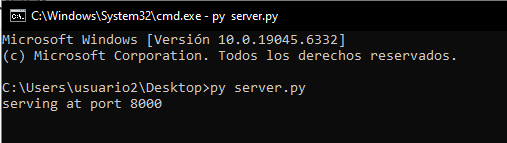

### 📁 Ejercicio 2: Servidor personalizado

#### Pasos para realizar el ejercicio:

1. Copiar el código del enlace facilitado por el profesor
2. Abrir la línea de comandos (CMD)
3. Navegar a la ruta donde se encuentra el código
4. Ejecutar el archivo Python y verificar el funcionamiento del servidor

- [Volver al índice principal](../README.md)