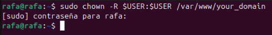

<!-- https://www.digitalocean.com/community/tutorials/how-to-install-linux-apache-mysql-php-lamp-stack-on-ubuntu-20-04-es#paso-4-crear-un-host-virtual-para-su-sitio-web -->

### 📁 Ejercicio 3: Instalación de Apache, MySQL y PHP

#### Paso 1: Instalación de Apache

1. Primero actualizamos nuestra máquina con apt update y upgrade
   

2. Ahora instalamos apache2
   

3. sudo ufw app list es para ver las aplicaciones disponibles en ufw
   

4. ahora ponemos sudo ufw allow in apache para permitir el tráfico entrante
   

5. Y ahora vemos el estado, en nuestro caso nos sale desactivado, lo mantenemos
   

6. Ahora abrimos el navegador y vemos el localhost para verificar que se nos instaló bien el apache
   

#### Paso 2: Instalación de MySQL

7. Ahora instalamos mysql-server
   

1. Descargamos mysql secure
   

1. Ejecutamos mysql
   

1. Salimos con el comando exit
   

#### Paso 3: Instalación de MySQL

4. Instalamos PHP
   

5. Verificamos la version de php
   

### Paso 4: Crear un host virtual para su sitio web

6. Creamos el directorio para your_domain de la siguiente manera:
   

7. Ahora le asignamos la propiedad al directorio con la variable de entorno `$USER`, que hará referencia al usuario del sistema actual:
   

8. Ahora abrimos un nuevo archivo de configuracion en el siguiente directorio de apache usando el editor de linea de comandos:
   

9. De esta manera nos creará un nuevo archivo en blanco y deberemos copiar lo siguiente:
   

10. Ahora podemos usar `a2ensite` para habilitar el nuevo host virtual:
    

11. Ahora nos aseguramos de que el archivo de configuración no contenga errores de sintaxis para esto ejecutamos el siguiente comando
    

12. Ahora conviene que deshabilitemos el sitio web predeterminado que viene instalado con apache para esto hacemos el siguiente comando:
    

13. Procedemos a reininiciar apache2:
    

14. procedemos a deshabilitar la web que viene predeterminada:
    

15. reverificamos que el archivo no tenga errores:
    

16. y ahora entramos a nuestro para empezar a escribir nuestra landing page
    

17. Ponemso que funciona
    

18. Abrimos el localhost y comprobamos de que realmente nuestra página cambio y se muestra lo que escribimos anteriormente
    

    ## 🔙 Navegación
- [Volver al índice principal](../README.md)