### 📁 Ejercicio 4: Cambiar configuracion de apache

1.  Apache utilizará el puerto 81 además del 80

    Para esto primero primero entramos al archvio de configuracion de los puertos
    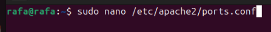

    Ahora agregamos para que esecuche por el puerto 81 `control + o` y `control + x` para guardar y salir
    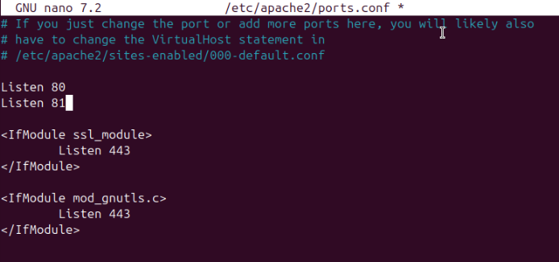

    Ahora simplemente reiniciamos el servicio con `sudo systemctl restart apache2` y ya estaría escuchando por ese puerto
    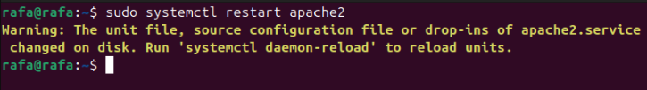

2.  Añadir el dominio “marisma.intranet” en el fichero “hosts”

    Ejecuta el comando para editar: Escribe `sudo nano /etc/hosts` y presiona Enter.
    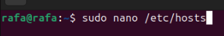

    Añade la entrada: En una nueva línea, escribe la dirección IP del servidor, un espacio, y luego el dominio: 192.168.1.100 marisma.intranet
    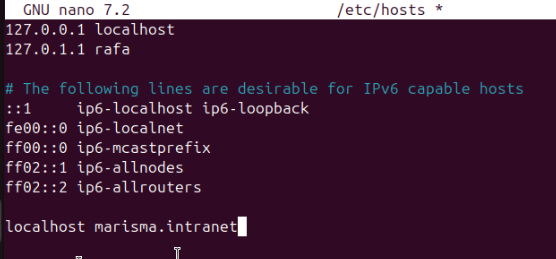

3.  Cambia la directiva “ServerTokens” para mostrar el nombre del producto.
    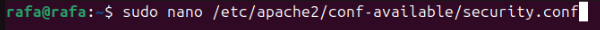
    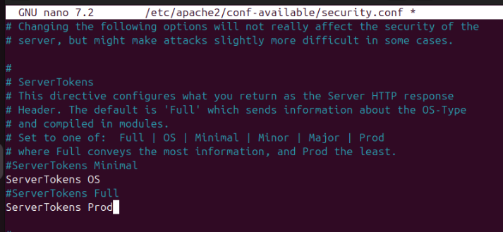

4.  Comprueba si se visualiza el pie de página en las páginas generadas por Apache (por ejemplo, en las páginas de error). Cambia el valor de la directiva “ServerSignature” y comprueba que funciona correctamente.
    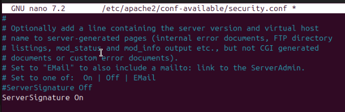
    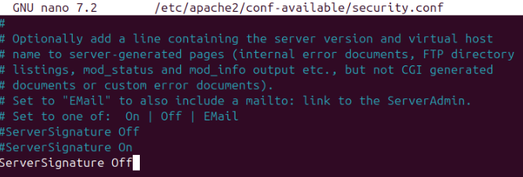
    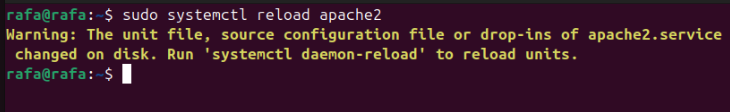

5.  Crea un directorio “prueba” y otro directorio “prueba2”. Incluye un par de páginas en cada una de ellas.
    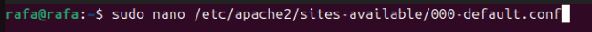
    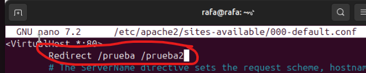
    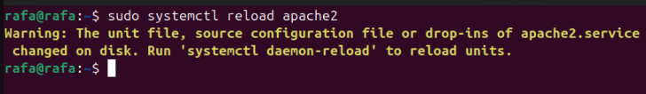
6.  Redirecciona el contenido de la carpeta “prueba” hacia “prueba2”
    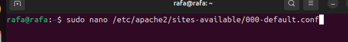
    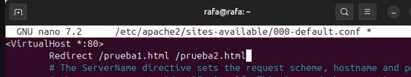
    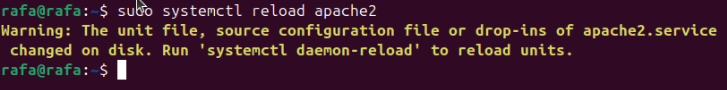

7.  Es posible redireccionar tan solo una página en lugar de toda la carpeta. Pruébalo.
    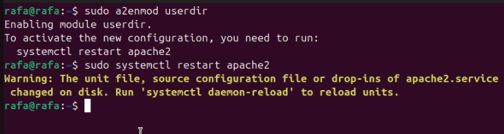

8.  Usa la directiva userdir
    

9.  Usa la directiva alias para redireccionar a una carpeta dentro del directorio de usuario.
    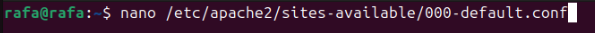
    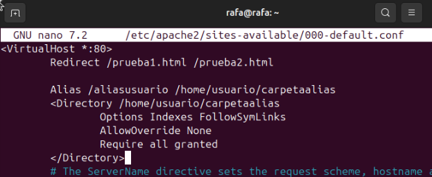
    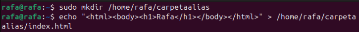
    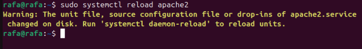

10. ¿Para qué sirve la directiva Options y dónde aparece. Comprueba si apache indexa los directorios. Si es así, ¿cómo lo desactivamos?

- `Options` controla características para un directorio (como listar archivos).
- `Indexes` permite mostrar el contenido de un directorio si no hay archivo índice.
- Para desactivar la indexación, usar:

apache
Options -Indexes

Recargamos apache tras los cambios con `sudo systemctl reload apache2`

- [Volver al índice principal](../README.md)
