### 📁 Ejercicio 4: Cambiar configuracion de apache

1.  Apache utilizará el puerto 81 además del 80

    Para esto primero primero entramos al archvio de configuracion de los puertos
    

      
    

    Ahora agregamos para que esecuche por el puerto 81 `control + o` y `control + x` para guardar y salir
    

      
    

    Ahora simplemente reiniciamos el servicio con `sudo systemctl restart apache2` y ya estaría escuchando por ese puerto
    

      
    

2.  Añadir el dominio "marisma.intranet" en el fichero "hosts"

    Ejecuta el comando para editar: Escribe `sudo nano /etc/hosts` y presiona Enter.
    

      
    

    Añade la entrada: En una nueva línea, escribe la dirección IP del servidor, un espacio, y luego el dominio: 192.168.1.100 marisma.intranet
    

      
    

3.  Cambia la directiva "ServerTokens" para mostrar el nombre del producto.
    

      
    

    

      
    

4.  Comprueba si se visualiza el pie de página en las páginas generadas por Apache (por ejemplo, en las páginas de error). Cambia el valor de la directiva "ServerSignature" y comprueba que funciona correctamente.
    

      
    

    

      
    

    

      
    

5.  Crea un directorio "prueba" y otro directorio "prueba2". Incluye un par de páginas en cada una de ellas.
    

      
    

    

      
    

    

      
    

6.  Redirecciona el contenido de la carpeta "prueba" hacia "prueba2"
    

      
    

    

      
    

    

      
    

7.  Es posible redireccionar tan solo una página en lugar de toda la carpeta. Pruébalo.
    

      
    

8.  Usa la directiva userdir
    

      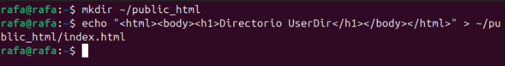
    

9.  Usa la directiva alias para redireccionar a una carpeta dentro del directorio de usuario.
    

      
    

    

      
    

    

      
    

    

      
    

10. 쯇ara qué sirve la directiva Options y dónde aparece. Comprueba si apache indexa los directorios. Si es así, 쯖칩mo lo desactivamos?

- `Options` controla características para un directorio (como listar archivos).
- `Indexes` permite mostrar el contenido de un directorio si no hay archivo índice.
- Para desactivar la indexación, usar:

apache
Options -Indexes

Recargamos apache tras los cambios con `sudo systemctl reload apache2`

# Trabajando con scripts (Debes publicarlos en Github)

### 1.Crea un script que añada un nombre de dominio y una ip al fichero hosts. Debemos comprobar que no existe dicho dominio en el fichero hosts

Primero creamos el reepositorio n la ruta d scripts apach, entramos y vamos a editar el fichero

  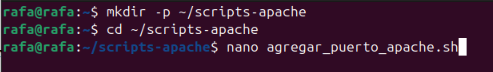

Agregamos el codigo para que podamos agregar el puerto al fichero de configuracion de apache, salimos y guardamos con `control + o` y `control + x`

  

Ahora probamos el script con `./agregar_puerto_apache.sh 81` y comprobamos que se ha agregado el puerto 81 al fichero de configuracion de apache

  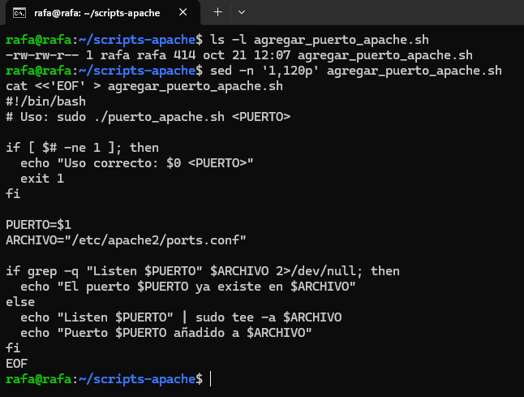

Ahora creamos el fichero añadir_hosts.sh y agregamos el codigo para que podamos agregar el dominio y la ip al fichero hosts

  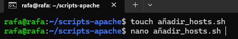

Agregamos ahora el codigo para ver si el dominio existe en el fichero

  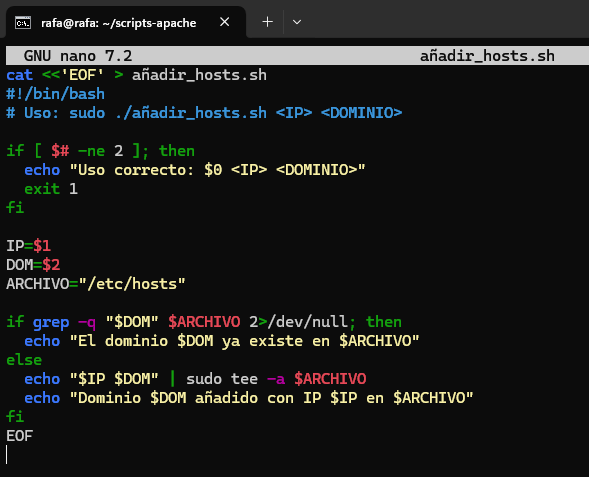

guardamos salimos mostramos de que eel fichero se crio y probamos

  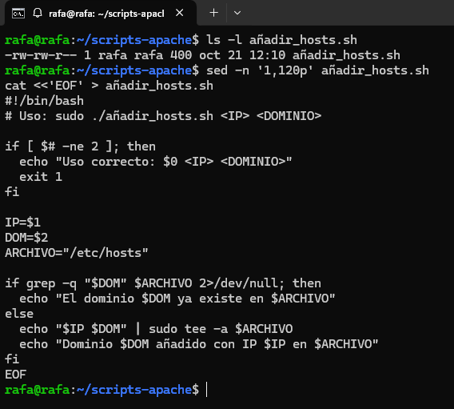

### 2. Crea un script que nos permita crear una página web con un título, una cabecera y un mensaje

Ahora creamos el fichero de crear_web.sh y agregamos el codigo para que podamos crear una pagina web con un titulo, una cabecera y un mensaje

  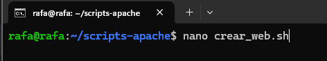

Ahora mostramos de que hemos creado los 3 ficheros y le damos peermisos con chmod de ejecución y mostramos de nuevo los permisos

  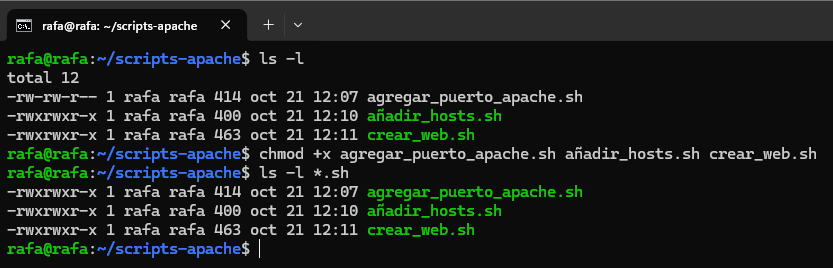

Ahora vamos a probar a crear la web solamentee con el script para eso usamos `./crear_web.sh marisma.intranet "Hola mundo" "Pagina creada con script"` , y mostramos l contnido

  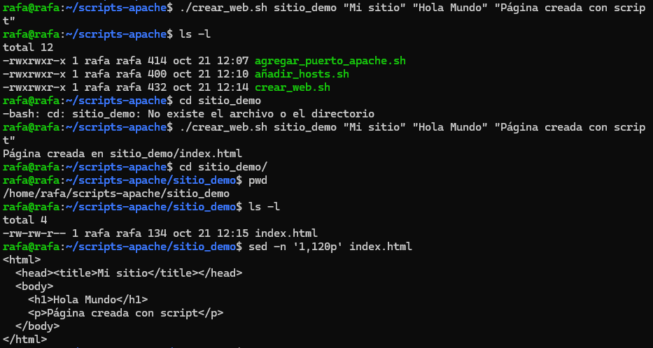

1 Mostramos que ahora todo y vamos a realizar una prueba local

  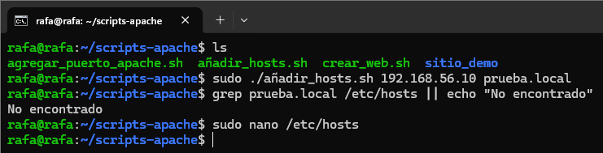

### 3. Crea un script que añada un nombre de dominio y una ip al fichero hosts. Debemos comprobar que no existe dicho dominio en el fichero hosts

Entramos al etc/hosts para agregar la ip y el dominio prueba.local

  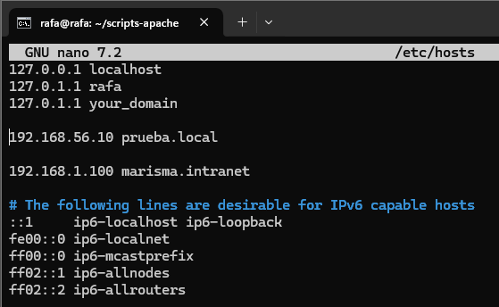

Usamos sed para agregar la ip y el dominio prueba.local al fichero hosts

  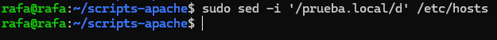

Ahora hacemos un sudo ./agregar_puerto_apache.sh 8080 para agregar el puerto 8080 al fichero de configuracion de apache

  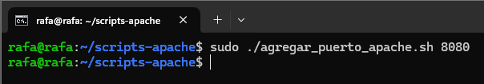

Ahora vemos la última linea del fichero hosts para ver si se ha agregado correctamente

  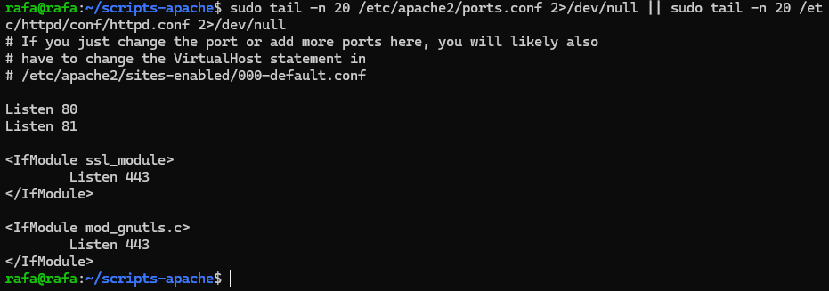

Y por ultimo reiniciamos apache con `sudo systemctl restart apache2`

  

- [Volver al índice principal](../README.md)
