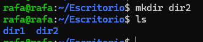
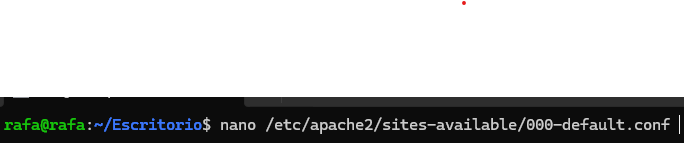
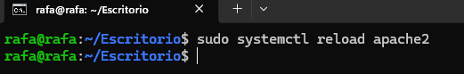
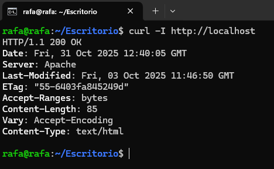
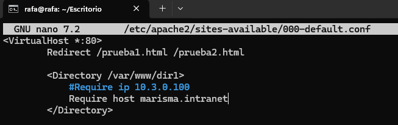
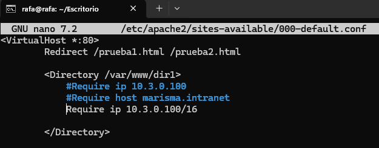
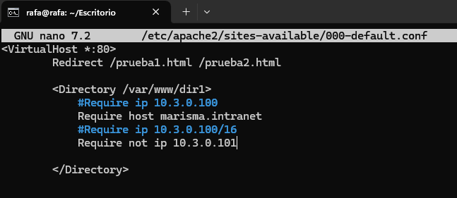
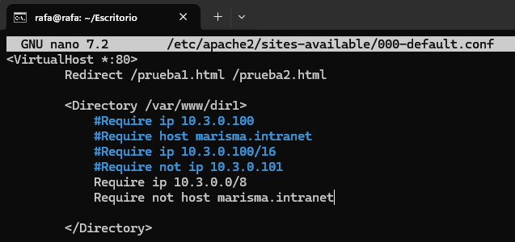

### 📁 Ejercicio 5: Directiva directory

1. Crea un directorio llamado "dir1" y otro llamado "dir2"

  <p align="center">
  
</p>

2. Explica qué diferencia existe entre ambos y muestra su equivalencia con la directiva Require:

```
<Directory /var/www/example1>
Order Deny,Allow
Deny from All
Allow from 192.168.1.100
</Directory>


<Directory /var/www/example1>
Order Allow,Deny
Deny from All
Allow from 192.168.1.100
</Directory>
```

| Configuración antigua                                             | Resultado                    | Nueva sintaxis (`Require`) |
| ----------------------------------------------------------------- | ---------------------------- | -------------------------- |
| `Order Deny,Allow` + `Deny from all` + `Allow from 192.168.1.100` | Solo permite a 192.168.1.100 | `Require ip 192.168.1.100` |
| `Order Allow,Deny` + `Deny from all` + `Allow from 192.168.1.100` | Niega a todos                | `Require all denied`       |

3. Para dir1
   a. Permite el acceso de las peticiones provenientes de 10.3.0.100

primero vamos a editar el fichero

 <p align="center">
      
    </p>

Y ahora agregamos la siguientes lineas

 <p align="center">
      
    </p>

Y recargamos el servicio de apache

 <p align="center">
      
    </p>

Para comprobarlo podemos usar el comando curl

 <p align="center">
      
    </p>

b. Permite el acceso desde "marisma.intranet"

Para esto entramos a la ruta donde antes y agregamos el 'require host marisma.intranet'

 <p align="center">
      
    </p>

Y agregamos el require del marisma.intranet

 <p align="center">
      
    </p>

c. Permite el acceso desde cualquier subdominio de "marisma.intranet"

Este antiguamente si teniamos que hacer lo del

```
Order Deny,Allow
Deny from all
Allow from .marisma.intranet
```

Pero a día de hoy con lo que pusimos anteriormente ya funciona en cualquier subdominio

d. Permite el acceso de las peticiones provenientes de "10.3.0.100" con máscara "255.255.0.0"

 <p align="center">
      
    </p>

4. Modifica la configuración de forma que el acceso a dir1:
   a. Se permita a "marisma.intranet" y no se permita desde 10.3.0.101"

lo mismo y para que no pueda ponemos el require not ip y la ip

 <p align="center">
      
    </p>
	
5. Modifica la configuración de forma que el acceso a dir2:
a. Se permita a "10.3.0.100/8" y no a "marisma.intranet

Permite cualquier IP del rango 10.x.x.x.

Bloquea específicamente cualquier cliente cuyo nombre de host coincida con marisma.intranet.

 <p align="center">
      
    </p>
    
- [Volver al índice principal](../README.md)
