### 📁 Ejercicio 6: Práctica Servidor Web (1º Trimestre)

Guía paso a paso en Ubuntu para montar un servidor web interno con Apache, WordPress, una aplicación Python bajo `mod_wsgi`, estadísticas con AWStats y un segundo servidor (`nginx`) en el puerto 8080 con PHP y phpMyAdmin. Incluye rutas, comandos, capturas sugeridas y comprobaciones.

---

## 🧭 Entorno y requisitos

- Sistema: Ubuntu Server/Desktop (22.04/24.04 recomendado)
- Privilegios: usuario con capacidad para `sudo`
- Navegador web para validar: Firefox/Chrome
- Dominio interno mediante `/etc/hosts`: `centro.intranet`, `departamentos.centro.intranet`, `servidor2.centro.intranet`

Carpeta propuesta para documentación del repositorio:

- `docs/` para apuntes y descripciones
- `images/` para capturas de pantalla referenciadas en este README

---

## 0) Preparación inicial

Actualiza el sistema y herramientas básicas.

```bash
sudo apt update && sudo apt -y upgrade
sudo apt -y install curl wget unzip git
```


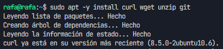

---

## 1) Configurar dominios locales (archivo `/etc/hosts`)

Edita `/etc/hosts` para resolver nombres internos al propio equipo.

```bash
sudo nano /etc/hosts
```


Añade al final:

```
127.0.0.1   centro.intranet
127.0.0.1   departamentos.centro.intranet
127.0.0.1   servidor2.centro.intranet
```
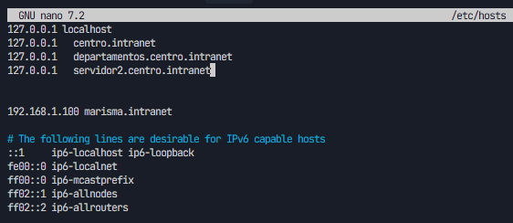

Guarda y cierra , CTRL + O , CTRL + X.

Comprobación rápida:

```bash
ping -c 1 centro.intranet
ping -c 1 departamentos.centro.intranet
ping -c 1 servidor2.centro.intranet
```

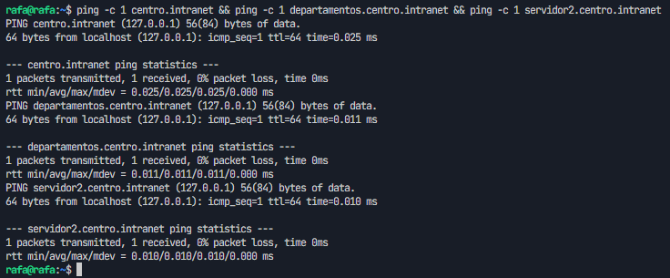

---

## 2) Instalar Apache y crear estructura de sitios

Instala Apache y utilidades:

```bash
sudo apt -y install apache2 apache2-utils
```


Crea las carpetas para los dos sitios de Apache:

```bash
sudo mkdir -p /var/www/centro.intranet
sudo mkdir -p /var/www/departamentos.centro.intranet
```


Asigna permisos al usuario de Apache (`www-data`):

```bash
sudo chown -R www-data:www-data /var/www/centro.intranet /var/www/departamentos.centro.intranet
sudo chmod -R 755 /var/www
```

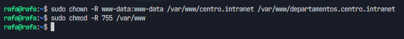

Verifica el estado del servicio:

```bash
sudo systemctl status apache2 --no-pager
```

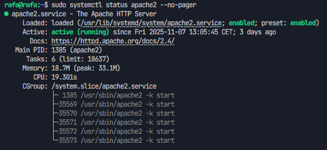


---

## 3) Activar soporte PHP y MySQL

Instala PHP para Apache y cliente/servidor de MySQL (MariaDB también es válido):

```bash
sudo apt -y install libapache2-mod-php php php-mysql php-cli php-curl php-xml php-gd
sudo apt -y install mysql-server
```


Seguridad básica de MySQL:

```bash
sudo mysql_secure_installation
```
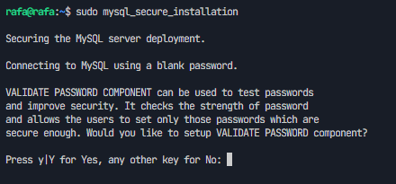


Reinicia Apache tras instalar módulos:

```bash
sudo systemctl restart apache2
```


---

## 4) Configurar VirtualHosts de Apache

Crearemos dos sitios: `centro.intranet` (WordPress) y `departamentos.centro.intranet` (Python con `mod_wsgi`).

### 4.1) VirtualHost para `centro.intranet`

```bash
sudo nano /etc/apache2/sites-available/centro.intranet.conf
```


Contenido:

```
<VirtualHost *:80>
    ServerName centro.intranet
    DocumentRoot /var/www/centro.intranet

    <Directory /var/www/centro.intranet>
        AllowOverride All
        Options Indexes FollowSymLinks
        Require all granted
    </Directory>

    ErrorLog ${APACHE_LOG_DIR}/centro_error.log
    CustomLog ${APACHE_LOG_DIR}/centro_access.log combined
</VirtualHost>
```
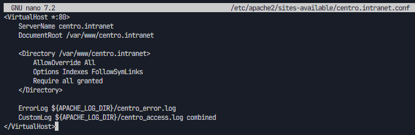


### 4.2) VirtualHost para `departamentos.centro.intranet`

```bash
sudo nano /etc/apache2/sites-available/departamentos.centro.intranet.conf
```


Contenido:

```
<VirtualHost *:80>
    ServerName departamentos.centro.intranet
    DocumentRoot /var/www/departamentos.centro.intranet

    # Configuración WSGI (se completará en el paso 6)
    WSGIDaemonProcess departamentos user=www-data group=www-data threads=5
    WSGIProcessGroup departamentos
    WSGIScriptAlias / /var/www/departamentos.centro.intranet/wsgi.py

    <Directory /var/www/departamentos.centro.intranet>
        Require all granted
    </Directory>

    ErrorLog ${APACHE_LOG_DIR}/departamentos_error.log
    CustomLog ${APACHE_LOG_DIR}/departamentos_access.log combined
</VirtualHost>
```

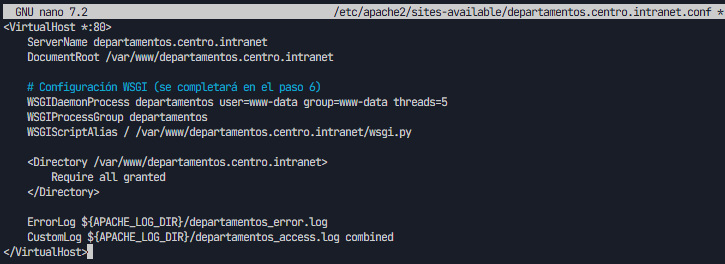


Habilita sitios y módulos necesarios:

```bash
sudo a2ensite centro.intranet.conf departamentos.centro.intranet.conf
sudo a2enmod rewrite
sudo systemctl reload apache2
```

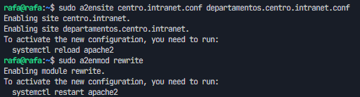


---

## 5) Instalar y configurar WordPress en `centro.intranet`

### 5.1) Crear base de datos y usuario en MySQL

Accede a MySQL:

```bash
sudo mysql
```
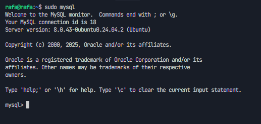


Ejecuta:

```sql
CREATE DATABASE wordpress CHARACTER SET utf8mb4 COLLATE utf8mb4_unicode_ci;
CREATE USER 'wpuser'@'localhost' IDENTIFIED BY 'wp_password_seguro';
GRANT ALL PRIVILEGES ON wordpress.* TO 'wpuser'@'localhost';
FLUSH PRIVILEGES;
EXIT;
```

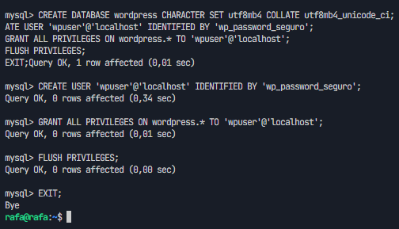


### 5.2) Descargar WordPress y preparar DocumentRoot

```bash
cd /tmp
wget https://wordpress.org/latest.zip
unzip latest.zip
sudo rsync -avP wordpress/ /var/www/centro.intranet/
```

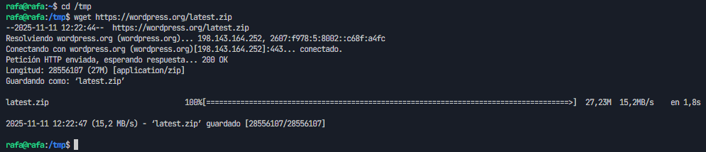
Ahora hacemos el unzip y el rsync para copiar los archivos a la carpeta de wordpress


### 5.3) Configurar `wp-config.php`

```bash
cd /var/www/centro.intranet
sudo cp wp-config-sample.php wp-config.php
sudo nano wp-config.php
```

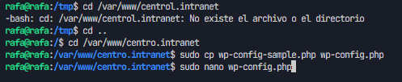


Actualiza:

```php
define( 'DB_NAME', 'wordpress' );
define( 'DB_USER', 'wpuser' );
define( 'DB_PASSWORD', 'wp_password_seguro' );
define( 'DB_HOST', 'localhost' );
```

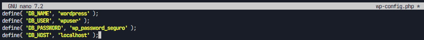

Genera claves y sales (es una api gratuita): https://api.wordpress.org/secret-key/1.1/salt/ 

Permisos:

```bash
sudo chown -R www-data:www-data /var/www/centro.intranet
sudo find /var/www/centro.intranet -type d -exec chmod 755 {} \;
sudo find /var/www/centro.intranet -type f -exec chmod 644 {} \;
```

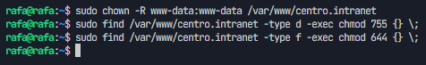


Reinicia Apache y abre en navegador:

Al tratar de reinciar apache he tenido un problema que me sallia que no quería reiniciarse me salia el error
```
AH00526: Syntax error on line 6 of /etc/apache2/sites-enabled/departamentos.centro.intranet.conf:
Invalid command 'WSGIDaemonProcess', perhaps misspelled or defined by a module not included in the server configuration
```
Entonces he tenido que instalar
```
sudo apt install libapache2-mod-wsgi-py3
```

Y hacemos lo siguiente, en el archivo de apache2 tenemos que meter el 
```
ServerName localhost
```

para poder quitar el error

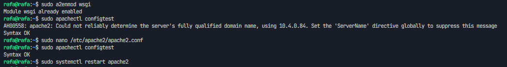


Ahora abrimos en nuestro navegador el localhost o centro intranet y nos debe de salir la pagina de instalacion de wordpress
```
http://centro.intranet
```

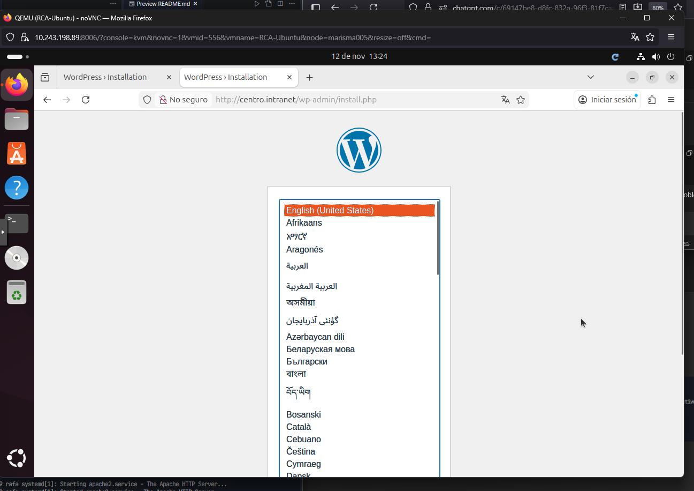

Ahora vamos a ir completando la instalacion paso a paso el instalador web (título del sitio, usuario admin, etc.).


---

## 6) Activar `mod_wsgi` y desplegar aplicación Python en `departamentos.centro.intranet`

Instala `mod_wsgi` para Python 3:

```bash
sudo apt -y install libapache2-mod-wsgi-py3 python3-venv
sudo a2enmod wsgi
sudo systemctl restart apache2
```

### 6.1) Crear aplicación mínima

Estructura básica:

```bash
sudo bash -c 'cat > /var/www/departamentos.centro.intranet/app.py' << 'EOF'
def application(environ, start_response):
    status = '200 OK'
    headers = [('Content-Type', 'text/html; charset=utf-8')]
    start_response(status, headers)
    body = [b"<h1>Aplicación Python OK</h1>",
            b"<p>Ruta: %s</p>" % environ.get('PATH_INFO', '/').encode('utf-8')]
    return body
EOF

sudo bash -c 'cat > /var/www/departamentos.centro.intranet/wsgi.py' << 'EOF'
import sys
sys.path.insert(0, '/var/www/departamentos.centro.intranet')
from app import application
EOF

sudo chown -R www-data:www-data /var/www/departamentos.centro.intranet
```

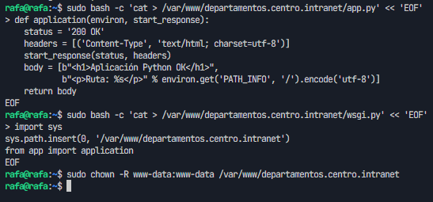


Reinicia Apache y prueba:

```
http://departamentos.centro.intranet/
```

Al tratar de reinciar apache y abrir la web me daba error 500, pero al ver el log he visto de que tenia conflicto con las tildes y he tenido que entrar al archivo y quitarlas

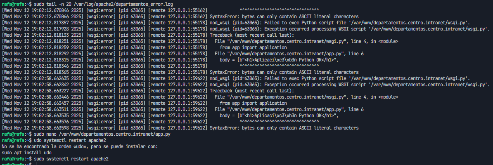
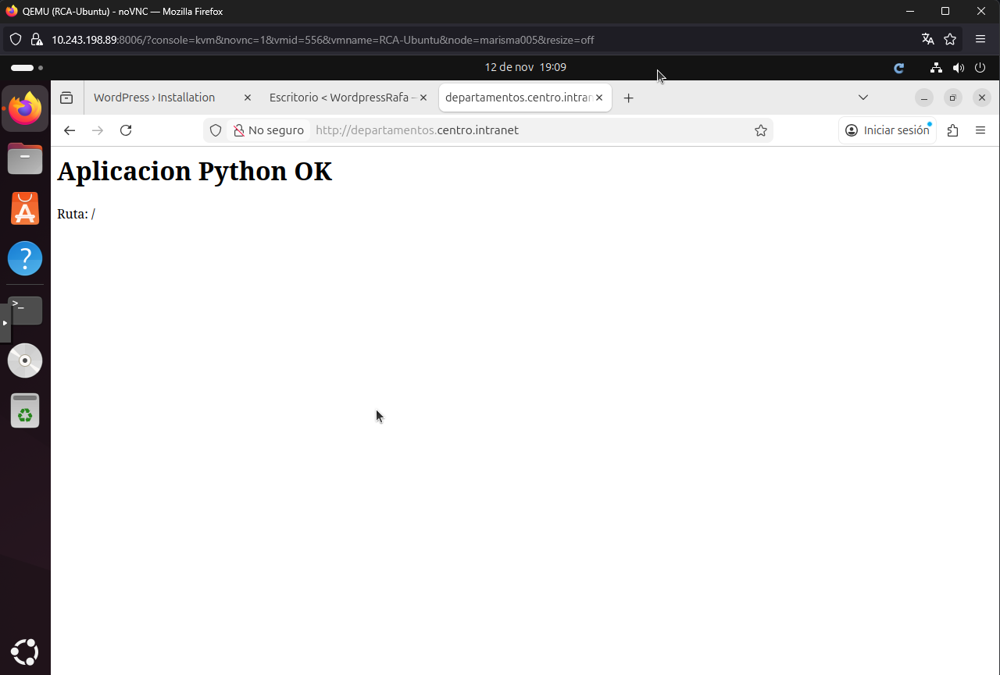


### 6.2) Proteger acceso con autenticación HTTP básica

Instala utilidades y crea usuarios:

```bash
sudo apt -y install apache2-utils
sudo htpasswd -c /etc/apache2/.htpasswd profesor
# (para más usuarios: sudo htpasswd /etc/apache2/.htpasswd alumno)
```

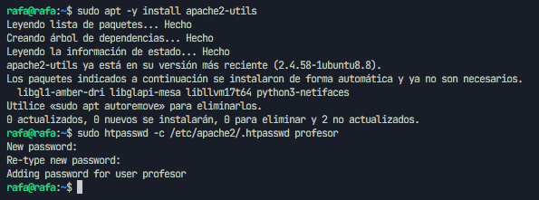

Restringe el Directorio en el VirtualHost (edita el archivo creado en el paso 4.2):

```bash
sudo nano /etc/apache2/sites-available/departamentos.centro.intranet.conf
```

Ajusta el bloque Directory:

```
<Directory /var/www/departamentos.centro.intranet>
    AuthType Basic
    AuthName "Acceso restringido"
    AuthUserFile /etc/apache2/.htpasswd
    Require valid-user
</Directory>
```

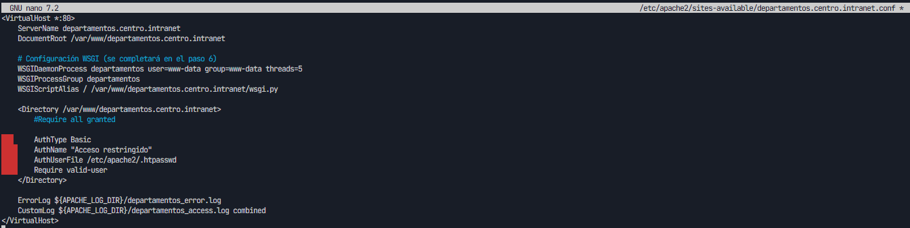


Aplica cambios:

```bash
sudo systemctl reload apache2
```

Prueba en navegador y valida el prompt de autenticación.
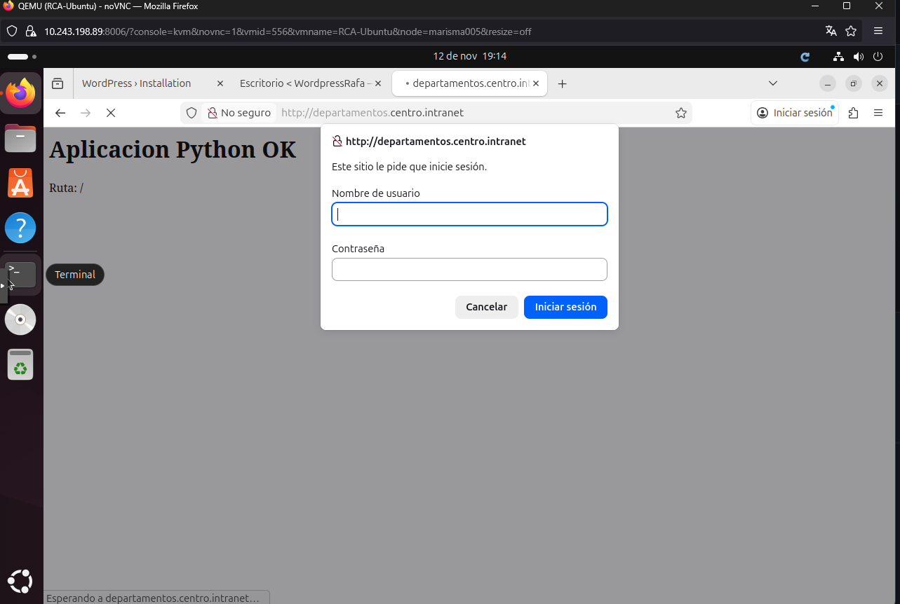

---

## 7) Instalar y configurar AWStats

Instala y habilita configuración de AWStats en Apache:

```bash
sudo apt -y install awstats
sudo a2enmod cgi
sudo a2enconf awstats
sudo systemctl reload apache2
```

Crea conf específica del sitio:

```bash
sudo cp /etc/awstats/awstats.conf /etc/awstats/awstats.centro.intranet.conf
sudo nano /etc/awstats/awstats.centro.intranet.conf
```

Valores clave:

```
LogFile="/var/log/apache2/centro_access.log"
SiteDomain="centro.intranet"
HostAliases="localhost 127.0.0.1 www.centro.intranet"
LogFormat=1
```
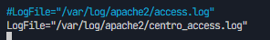


Actualiza estadísticas iniciales:

```bash
sudo /usr/lib/cgi-bin/awstats.pl -config=centro.intranet -update
```
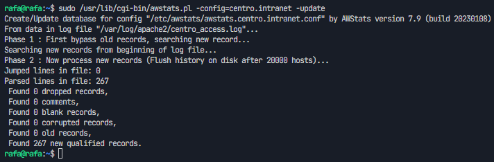

Accede al informe:

```
http://centro.intranet/awstats/awstats.pl?config=centro.intranet
```
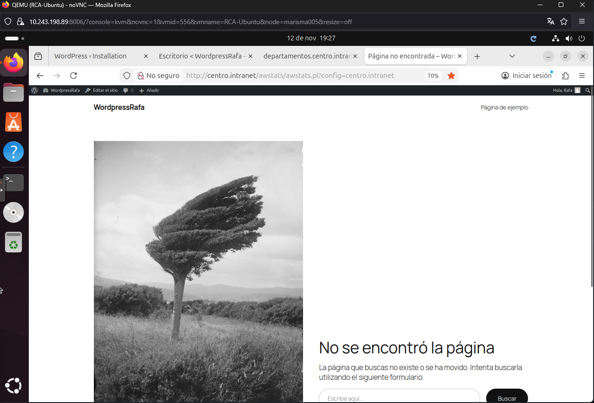


---

## 8) Segundo servidor: Nginx en puerto 8080 con PHP y phpMyAdmin

Instala Nginx + PHP-FPM:

```bash
sudo apt -y install nginx php-fpm php-mysql
```

Crea DocumentRoot:

```bash
sudo mkdir -p /var/www/servidor2.centro.intranet
echo "<?php phpinfo();" | sudo tee /var/www/servidor2.centro.intranet/info.php
sudo chown -R www-data:www-data /var/www/servidor2.centro.intranet
```

Configura el server block de Nginx (puerto 8080):

```bash
sudo nano /etc/nginx/sites-available/servidor2.centro.intranet
```

Contenido (ajusta la versión del socket de PHP según tu sistema, p. ej. `php8.2-fpm`):

```
server {
    listen 8080;
    server_name servidor2.centro.intranet;
    root /var/www/servidor2.centro.intranet;
    index index.php index.html index.htm;

    location / {
        try_files $uri $uri/ /index.php?$args;
    }

    location ~ \.php$ {
        include snippets/fastcgi-php.conf;
        fastcgi_pass unix:/run/php/php8.2-fpm.sock;
    }

    location ~* \.(js|css|png|jpg|jpeg|gif|ico)$ {
        expires 1d;
        access_log off;
    }
}

Habilita sitio y recarga Nginx:

```bash
sudo ln -s /etc/nginx/sites-available/servidor2.centro.intranet /etc/nginx/sites-enabled/
sudo nginx -t
sudo systemctl reload nginx
```

Prueba PHP info:

```
http://servidor2.centro.intranet:8080/info.php
```

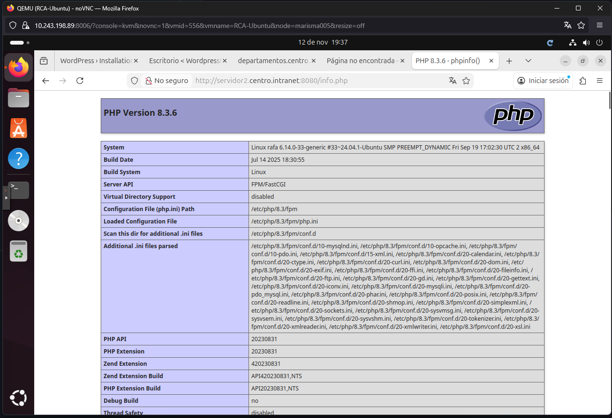

### 8.1) Instalar phpMyAdmin con Nginx

Instala phpMyAdmin:

```bash
sudo apt -y install phpmyadmin
```
Debemos seleccionar apache2 y aceptar luego nos pondrá para elegir una contraseña , en mi caso no le puse


Haz accesible phpMyAdmin bajo Nginx (método sencillo con symlink):

```bash
sudo ln -s /usr/share/phpmyadmin /var/www/servidor2.centro.intranet/phpmyadmin
sudo systemctl reload nginx
```

Accede:

```
http://servidor2.centro.intranet:8080/phpmyadmin
```


---

## 9) Comprobaciones y validaciones

- Apache sirve WordPress en `http://centro.intranet`
- Apache sirve aplicación Python en `http://departamentos.centro.intranet` con autenticación básica
- AWStats accesible en `http://centro.intranet/awstats/awstats.pl?config=centro.intranet`
- Nginx en `http://servidor2.centro.intranet:8080` con PHP y phpMyAdmin

Comandos útiles:

```bash
sudo systemctl status apache2 nginx mysql
sudo tail -f /var/log/apache2/*.log
sudo tail -f /var/log/nginx/access.log /var/log/nginx/error.log
curl -I http://centro.intranet
curl -I http://departamentos.centro.intranet
curl -I http://servidor2.centro.intranet:8080
```

Curl a los sitios para probar que funcionan
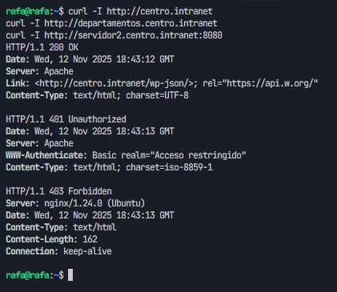
Logs apache2
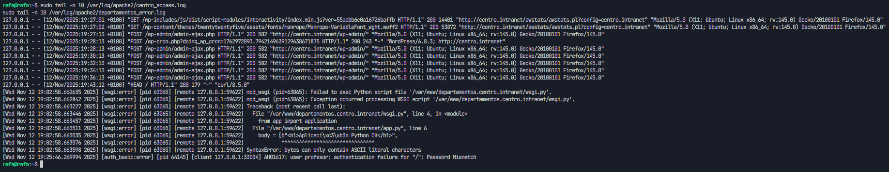

---

## 10) Entrega en GitHub

- Estructura de este repositorio:
  - `README.md` (este documento)
  - `images/` (todas las capturas mencionadas)
  - `docs/` (opcional, para notas adicionales)
- Incluye fragmentos de configuración relevantes:
  - `/etc/hosts`
  - `/etc/apache2/sites-available/centro.intranet.conf`
  - `/etc/apache2/sites-available/departamentos.centro.intranet.conf`
  - `/etc/awstats/awstats.centro.intranet.conf`
  - `/etc/nginx/sites-available/servidor2.centro.intranet`
  - `wsgi.py`, `app.py`, `wp-config.php` (sin credenciales sensibles)
- Sube las imágenes de la máquina virtual: cada paso tiene su captura sugerida en `./images/`.
- Enlaza este repositorio en el repositorio del módulo indicando claramente: “Práctica de servidores web”.
- Fecha límite de entrega: 28 de noviembre.

Sugerencia de mensajes de commit:

```text
docs: añade guía paso a paso y estructura de capturas
feat(apache): vhosts para centro y departamentos
feat(wordpress): instalación y configuración inicial
feat(python): app wsgi mínima y autenticación básica
feat(awstats): configuración sitio centro.intranet
feat(nginx): server 8080 con php y phpmyadmin
```

---

## Anexos

### A) Rutas clave

- `/etc/hosts` — resolución de nombres internos
- `/var/www/centro.intranet` — WordPress
- `/var/www/departamentos.centro.intranet` — App Python + WSGI
- `/etc/apache2/sites-available/*.conf` — VirtualHosts Apache
- `/var/log/apache2/*.log` — Logs Apache
- `/etc/awstats/awstats.centro.intranet.conf` — AWStats
- `/etc/nginx/sites-available/servidor2.centro.intranet` — Server block Nginx
- `/var/www/servidor2.centro.intranet` — Sitio Nginx con PHP

### B) Problemas frecuentes

- “No carga WordPress”: revisa permisos y `wp-config.php`.
- “Python da 500”: revisa `wsgi.py`, permisos y `error.log`.
- “AWStats vacío”: verifica `LogFile` y ejecuta `-update`.
- “Nginx no ejecuta PHP”: confirma socket de `php-fpm` correcto.
- “Visualizar las versiones de PHP“
