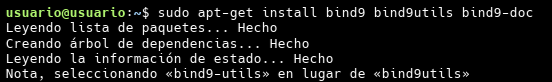
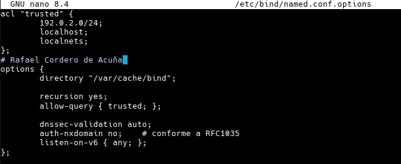
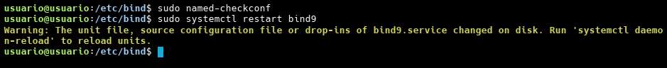
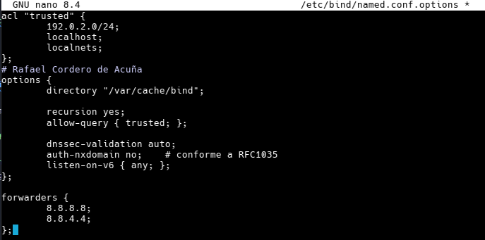
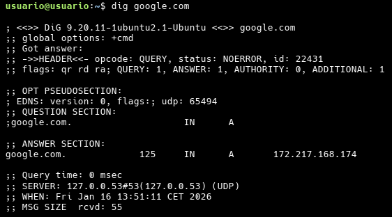
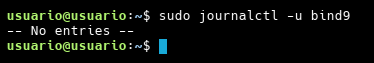

# Mi Guía: Configurando Bind como Servidor DNS en Ubuntu 16.04

¡Hola! En esta guía voy a explicar paso a paso cómo he configurado Bind9 para que funcione como un servidor DNS. Lo bueno de esto es que podemos usarlo tanto para guardar en caché las consultas (y que todo vaya más rápido) como para reenviarlas a otros servidores externos.

## Paso 1: Instalando lo básico

Lo primero que tenemos que hacer es instalar Bind9 y algunas utilidades que nos vendrán de perlas para gestionar todo mejor.

```bash
sudo apt-get update
sudo apt-get install bind9 bind9utils bind9-doc
```



---

## Paso 2: Configuración del Servidor DNS (Modo Caché)

Aquí es donde empieza lo interesante. Vamos a configurar el servidor para que resuelva nombres y guarde las respuestas en caché.

### Editando el archivo de opciones

Me metí a editar el archivo `/etc/bind/named.conf.options` para definir quién tiene permiso para hacer consultas. He creado una ACL llamada "trusted" para asegurarme de que solo mi red local pueda usar el servidor.

```bash
sudo nano /etc/bind/named.conf.options
```


Así es como dejé el archivo (recuerda cambiar `192.0.2.0/24` por el rango de tu propia red):

```text
acl "trusted" {
        192.0.2.0/24;
        localhost;
        localnets;
};

options {
        directory "/var/cache/bind";

        recursion yes;
        allow-query { trusted; };

        dnssec-validation auto;
        auth-nxdomain no;    # conforme a RFC1035
        listen-on-v6 { any; };
};
```



### Comprobar que no he roto nada

Antes de reiniciar el servicio, siempre paso el comando `named-checkconf`. Si no sale ningún error, es que la sintaxis está perfecta. Luego ya reiniciamos Bind.

```bash
sudo named-checkconf
sudo systemctl restart bind9
```



---

## Paso 3: Configuración como Servidor de Reenvío (Forwarding)

Si lo que queremos es que nuestro servidor no haga todo el trabajo sucio y simplemente le pregunte a otros DNS más grandes (como los de Google o Cloudflare), usamos los `forwarders`.

He vuelto a editar el mismo archivo `/etc/bind/named.conf.options` y he añadido las IPs de los DNS de Google dentro de la sección `options`:

```text
        forwarders {
                8.8.8.8;
                8.8.4.4;
        };
```



Después de guardar, aplicamos los cambios con un reinicio:

```bash
sudo named-checkconf
sudo systemctl restart bind9
```

---

## Paso 4: ¡A probar que todo funcione!

Para verificar que el servidor está respondiendo correctamente, me fui a una máquina cliente y usé el comando `dig` para consultar una web.

```bash
dig google.com
```

La clave para saber si el caché está funcionando es mirar el `Query time`. La primera vez que preguntas por un dominio puede tardar, pero la segunda vez debería responder en **0 msec** o casi nada.



### ¿Y si algo falla?

Si ves que no responde, lo mejor es echarle un ojo a los logs para ver qué está pasando por debajo:

```bash
sudo journalctl -u bind9
```



---
*Esta guía la he montado basándome en el [Tutorial de DigitalOcean](https://www.digitalocean.com/community/tutorials/how-to-configure-bind-as-a-caching-or-forwarding-dns-server-on-ubuntu-16-04).*
