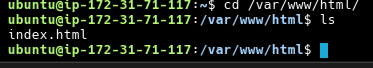
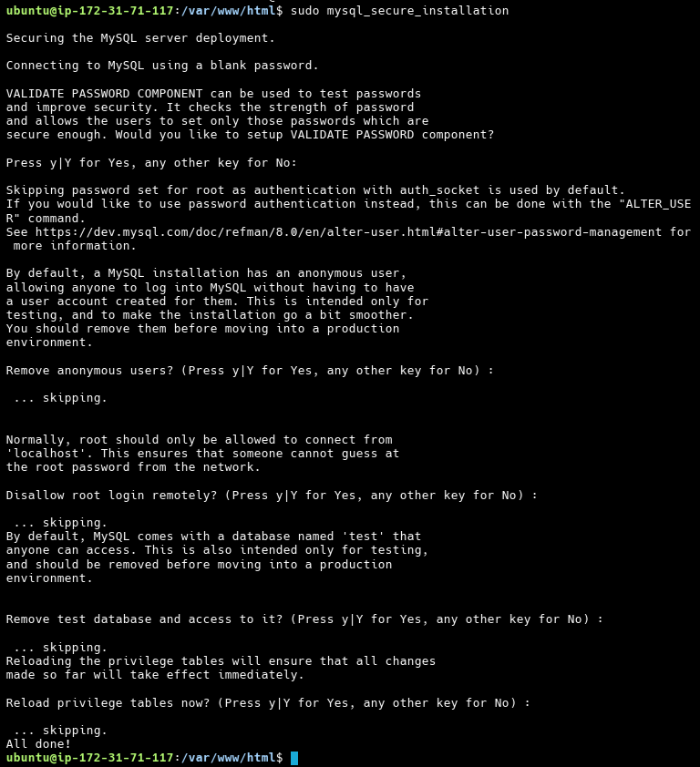
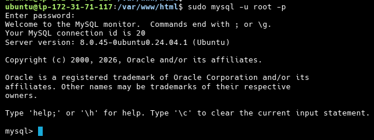
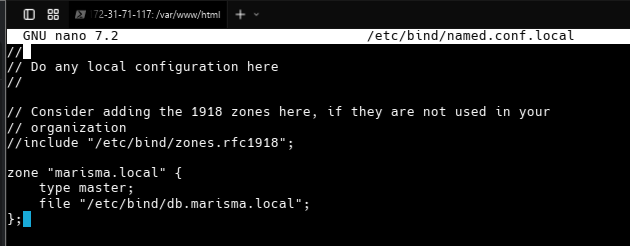
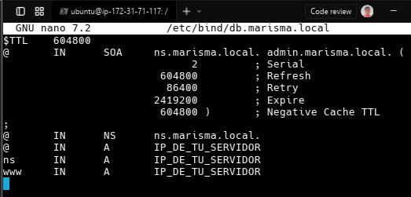
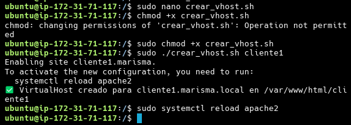
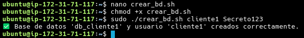
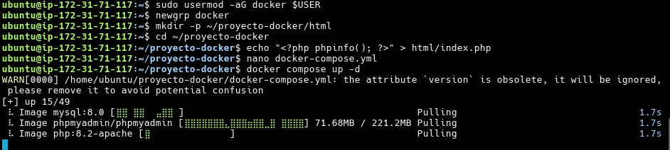

# Práctica 2º Trimestre – Servidor de Alojamiento Web

## 📌 Objetivo

El objetivo de esta práctica es **instalar, configurar y poner en marcha un servidor de alojamiento web** que permita ofrecer servicios web **estáticos y dinámicos (PHP)** de forma **automatizada mediante scripts**, simulando un entorno real de hosting.

Cada cliente dispondrá de:

- Un **directorio web propio** con una página por defecto
- Acceso mediante **FTP (con TLS), SFTP y SSH**
- Una **base de datos MySQL** administrable con **phpMyAdmin**
- Un **subdominio propio** gestionado desde el servidor DNS

---

## 🖥️ Entorno de trabajo

### Plataforma

- **Proveedor cloud:** Amazon Web Services (AWS)
- **Servicio:** EC2 (Elastic Compute Cloud)
- **Sistema Operativo:** Ubuntu Server 22.04 LTS
- **Tipo de instancia recomendado:** t2.micro (apta para Free Tier)

---

## ☁️ 0️⃣ Creación de la máquina virtual en AWS (EC2)

> Este apartado es **clave**, ya que AWS no crea la máquina automáticamente. Aquí se explica **paso a paso desde cero**.

### 0.1 Acceder a AWS

1. Accede a https://aws.amazon.com/
2. Inicia sesión en tu cuenta
3. En la barra superior, selecciona la región más cercana (ej: **eu-west-3 – París**)

---

### 0.2 Crear una instancia EC2

1. En el buscador de servicios escribe **EC2**
2. Pulsa en **Launch instance**

<!-- Agregamos una imagen -->


#### Paso 1 – Nombre

- Name: `ServidorWebMarisma`


#### Paso 2 – AMI (Sistema Operativo)

- Selecciona **Ubuntu Server 22.04 LTS (Free Tier eligible)**


#### Paso 3 – Tipo de instancia

- Selecciona **t2.micro**


#### Paso 4 – Clave SSH

1. Create new key pair
2. Nombre: `marisma-key`
3. Tipo: RSA
4. Descargar el archivo `.pem`

⚠️ **No pierdas este archivo**, es la única forma de acceder por SSH.


#### Paso 5 – Configuración de red (Security Group)


Crear un nuevo Security Group con las siguientes reglas **INBOUND**:

| Tipo  | Puerto     | Origen    |
| ----- | ---------- | --------- |
| SSH   | 22         | Tu IP     |
| HTTP  | 80         | 0.0.0.0/0 |
| HTTPS | 443        | 0.0.0.0/0 |
| FTP   | 21         | 0.0.0.0/0 |
| SFTP  | 22         | 0.0.0.0/0 |
| DNS   | 53 TCP/UDP | 0.0.0.0/0 |
| MySQL | 3306       | 127.0.0.1 |

#### Paso 6 – Almacenamiento

- 8–10 GB (por defecto)


#### Paso 7 – Lanzar instancia

Pulsa **Launch instance**


Ahora esperamos un poco


Nos saldrá la siguiente , le damos a Conectar

Y le damos a conectar


Y nos cargará lo siguiente


---

### 0.3 Conexión por SSH desde tu equipo

Desde la carpeta donde descargaste la clave:

```bash
chmod 400 marisma-key.pem
ssh -i marisma-key.pem ubuntu@IP_PUBLICA_EC2
```

> La IP pública se obtiene desde el panel de EC2

---

- Sistema Operativo: **Debian / Ubuntu Server**
- Servicios principales:
  - Apache2
  - PHP
  - MySQL / MariaDB
  - phpMyAdmin
  - Bind9 (DNS)
  - ProFTPD (FTP con TLS)
  - OpenSSH
  - Python3

> ⚠️ Todos los comandos deben ejecutarse como **root** o con `sudo`.

---

## 1️⃣ Instalación de servicios

```bash
apt update && apt upgrade -y
apt install apache2 php libapache2-mod-php php-mysql mysql-server \
phpmyadmin bind9 proftpd openssh-server python3 -y
```

Y empezamos a actualizar la maquina y instalar los servicios


Instalamos ahora apache2 php y todas las cosas


como vamos a instalar todo de uno esperamos un poco


Ahora usamos el comando de phpmyadmin bind9 proftpd openssh-server python 3 -y para instalar todo de uno de nuevo
pero me sale command not found entonces vamos a activar el repositorio de universe para esto hacemos lo siguiente

```bash
sudo add-apt-repository universe
sudo apt update
```


y ahora actualizamos


Ahora habilitamos los módulos necesarios en Apache:

```bash
a2enmod rewrite
systemctl restart apache2
```
Al ejecutar tenemos que tener las contraseñas a mano o nos sucederá esto:
	

como me estaba dando muchos problemas he decidido acceder por ssh desde mi terminal Warp a la máquina para esto simplemente nos tenemos que dirigir a nuestro panel del laboratorio y descargar el archivo que pone PEM 

Cogemos la ip publica de la maquina y al copiamos y ahora hacemos el ssh


Tras loguearnos hacemos lo mismo y ya si nos permite

---

## 2️⃣ Configuración de Apache

- Directorio base de los clientes:

```bash
/var/www/html/
```




Cada cliente tendrá su propio **VirtualHost** y su propio `DocumentRoot`.

---

## 3️⃣ Configuración de MySQL y phpMyAdmin

Asegurar MySQL:

```bash
mysql_secure_installation
```




Acceder a MySQL:

```bash
mysql -u root -p
```




### ⚠️ Solución a error 404 Not Found en phpMyAdmin

Si al intentar acceder recibes un mensaje de **Not Found**, sigue estos pasos para asegurar que Apache cargue la configuración de phpMyAdmin.

**Paso 1: Verificar instalación**

Primero comprueba que el archivo de configuración existe:

```bash
ls -l /etc/phpmyadmin/apache.conf
```

> **Nota:** Si dice "No such file or directory", reinstala phpMyAdmin con `sudo apt install --reinstall phpmyadmin` y asegúrate de marcar **apache2** con la barra espaciadora (aparecerá un asterisco `*`) antes de pulsar Enter.

**Paso 2: Activar configuración (Método recomendado)**

```bash
# Forzamos el enlace simbólico por si existiera uno incorrecto
sudo ln -sf /etc/phpmyadmin/apache.conf /etc/apache2/conf-available/phpmyadmin.conf

# Activamos la configuración
sudo a2enconf phpmyadmin

# Recargamos Apache
sudo systemctl reload apache2
```

**Paso 3: Método alternativo (si el anterior falla)**

Si obtienes errores como `ERROR: Conf phpmyadmin does not exist!`, usa este método infalible:

```bash
# Añade la configuración directamente al final de apache2.conf
echo "Include /etc/phpmyadmin/apache.conf" | sudo tee -a /etc/apache2/apache2.conf

# Reinicia Apache
sudo systemctl restart apache2
```

Ahora sí, **phpMyAdmin** quedará accesible desde:

```
http://IP_SERVIDOR/phpmyadmin
```

### 🔐 Crear usuario administrador para phpMyAdmin

Por defecto, **MySQL** en Ubuntu no permite el acceso remoto al usuario `root` ni el inicio de sesión con contraseña en phpMyAdmin (usa `auth_socket`).

Para poder acceder, debes crear un usuario administrador manualmente:

```bash
sudo mysql -u root
```

Dentro de la consola de MySQL, ejecuta:

```sql
CREATE USER 'admin'@'localhost' IDENTIFIED BY 'admin123';
GRANT ALL PRIVILEGES ON *.* TO 'admin'@'localhost' WITH GRANT OPTION;
FLUSH PRIVILEGES;
EXIT;
```


Ahora podrás entrar en phpMyAdmin con:
- **Usuario:** `admin`
- **Contraseña:** `admin123`


---

## 4️⃣ Configuración del servidor DNS (Bind9)

### ⚠️ Verificación previa (Importante)

Es posible que **Bind9** no se haya instalado correctamente. Antes de continuar, verifica que la carpeta de configuración existe:

```bash
ls -d /etc/bind
```

Si recibes un error como `ls: cannot access '/etc/bind': No such file or directory`, **debes instalarlo manualmente**:

```bash
sudo apt update
sudo apt install bind9 bind9utils bind9-doc -y
```

### Añadir zona en `named.conf.local`

Vamos a editar el archivo de configuración local de Bind9. **Nota:** No uses `cd` para abrir archivos, usa un editor de texto como `nano`.

Ejecuta el siguiente comando:

```bash
sudo nano /etc/bind/named.conf.local
```

Añade el siguiente contenido al final del archivo:

```bash
zone "marisma.local" {
    type master;
    file "/etc/bind/db.marisma.local";
};
```




> **Para guardar y salir en nano:**
> 1. Pulsa `Ctrl + O` y luego `Enter` (para guardar).
> 2. Pulsa `Ctrl + X` (para salir).

### Zona principal

Ahora vamos a crear el archivo de zona donde se definen los registros DNS.

Ejecuta:

```bash
sudo cp /etc/bind/db.local /etc/bind/db.marisma.local
sudo nano /etc/bind/db.marisma.local
```

Borra el contenido y pega lo siguiente (sustituyendo `IP_DE_TU_SERVIDOR` por la IP privada de tu EC2, ej: `172.31.xx.xx`):

```dns
$TTL    604800
@       IN      SOA     ns.marisma.local. admin.marisma.local. (
                              2         ; Serial
                         604800         ; Refresh
                          86400         ; Retry
                        2419200         ; Expire
                         604800 )       ; Negative Cache TTL
;
@       IN      NS      ns.marisma.local.
@       IN      A       IP_DE_TU_SERVIDOR
ns      IN      A       IP_DE_TU_SERVIDOR
www     IN      A       IP_DE_TU_SERVIDOR
```





> **Para guardar y salir en nano:**
> 1. Pulsa `Ctrl + O` y luego `Enter` (para guardar).
> 2. Pulsa `Ctrl + X` (para salir).

Reiniciar el servicio para aplicar cambios:

```bash
sudo systemctl restart bind9
```

---

## 5️⃣ Acceso FTP, SFTP y SSH

- FTP configurado con **ProFTPD + TLS**
- Acceso seguro por **SSH y SFTP** para cada usuario del sistema

Cada cliente será un **usuario del sistema**, con acceso restringido a su directorio.

---

## 6️⃣ Automatización mediante scripts

Toda la gestión de clientes se realizará mediante **scripts en Bash**.

### 🔹 Funcionalidades automatizadas

- Creación de usuario del sistema
- Creación del directorio web
- Creación del VirtualHost de Apache
- Creación de subdominio DNS (directa e inversa)
- Creación de base de datos y usuario MySQL
- Acceso por FTP / SSH / SFTP

---

## 7️⃣ Script: Creación de subdominio DNS

Este script automatiza la creación de subdominios en el archivo de zona de Bind9.

**Pasos para crearlo:**

1. Crear el archivo:
   ```bash
   nano crear_subdominio.sh
   ```

2. Pegar el siguiente contenido:

```bash
#!/bin/bash
# crear_subdominio.sh usuario ip

if [ $# -le 1 ]; then
  echo "Error. Introduce subdominio e IP"
  echo "Uso: ./crear_subdominio.sh <nombre_cliente> <ip>"
  exit 1
fi

USER=$1
IP=$2
SUB_DOMAIN="${USER}.marisma.local"
ZONE_FILE="/etc/bind/db.marisma.local"

# Crear directorio web si no existe
if [ ! -d "/var/www/html/$USER" ]; then
    mkdir -p /var/www/html/$USER
    chown -R www-data:www-data /var/www/html/$USER
    chmod -R 755 /var/www/html/$USER
    echo "<h1>Bienvenido a $SUB_DOMAIN</h1>" > /var/www/html/$USER/index.html
fi

# Añadir registro DNS
cat <<EOF >> $ZONE_FILE
\$ORIGIN ${SUB_DOMAIN}.
@   IN  A   ${IP}
www IN  A   ${IP}
EOF

# Reiniciar servicios
systemctl reload bind9
systemctl reload apache2

echo "✅ Subdominio $SUB_DOMAIN creado y apuntando a $IP"
```

3. Guardar y dar permisos de ejecución:
   ```bash
   chmod +x crear_subdominio.sh
   ```

4. **Ejecutar el script:**
   ```bash
   sudo ./crear_subdominio.sh cliente1 172.31.XX.XX
   ```

---

## 8️⃣ Script: Creación de VirtualHost Apache

Este script crea la configuración de Apache para que el subdominio cargue su propia carpeta.

**Pasos para crearlo:**

1. Crear el archivo:
   ```bash
   nano crear_vhost.sh
   ```

2. Pegar el siguiente contenido:

```bash
#!/bin/bash
# crear_vhost.sh usuario

if [ -z "$1" ]; then
    echo "Error: Debes indicar el nombre del usuario/cliente."
    exit 1
fi

USER=$1
CONF="${USER}.marisma.conf"
DOCROOT="/var/www/html/${USER}"
SUBDOMAIN="${USER}.marisma.local"

cat <<EOF > /etc/apache2/sites-available/$CONF
<VirtualHost *:80>
    ServerName www.$SUBDOMAIN
    ServerAlias $SUBDOMAIN
    DocumentRoot $DOCROOT

    <Directory $DOCROOT>
        AllowOverride All
        Require all granted
    </Directory>

    ErrorLog /var/log/apache2/${USER}_error.log
    CustomLog /var/log/apache2/${USER}_access.log combined
</VirtualHost>
EOF

# Habilitar sitio y recargar
a2ensite $CONF
systemctl reload apache2

echo "✅ VirtualHost creado para $SUBDOMAIN en $DOCROOT"
```

3. Guardar y dar permisos:
   ```bash
   chmod +x crear_vhost.sh
   ```

4. **Ejecutar el script:**
   ```bash
   sudo ./crear_vhost.sh cliente1
   ```




---

## 9️⃣ Script: Creación de base de datos MySQL

Este script crea una base de datos y un usuario específico para el cliente.

**Pasos para crearlo:**

1. Crear el archivo:
   ```bash
   nano crear_bd.sh
   ```

2. Pegar el siguiente contenido:

```bash
#!/bin/bash
# crear_bd.sh usuario password

if [ $# -le 1 ]; then
  echo "Error. Introduce usuario y contraseña"
  exit 1
fi

USER=$1
PASS=$2
DB="db_${USER}"

mysql -u root <<EOF
CREATE DATABASE IF NOT EXISTS $DB;
CREATE USER IF NOT EXISTS '$USER'@'localhost' IDENTIFIED BY '$PASS';
GRANT ALL PRIVILEGES ON $DB.* TO '$USER'@'localhost';
FLUSH PRIVILEGES;
EOF

echo "✅ Base de datos '$DB' y usuario '$USER' creados correctamente."
```

> **Nota:** Si tu usuario root de MySQL tiene contraseña, cambia la línea `mysql -u root` por `mysql -u root -pTuContraseña`.

3. Guardar y dar permisos:
   ```bash
   chmod +x crear_bd.sh
   ```

4. **Ejecutar el script:**
   ```bash
   sudo ./crear_bd.sh cliente1 Secreto123
   ```




---

## 🔟 Ejecución de aplicaciones Python

Instalar soporte WSGI:

```bash
apt install libapache2-mod-wsgi-py3 -y
a2enmod wsgi
systemctl restart apache2
```

Permite ejecutar aplicaciones Python desde Apache.

---

## 🐳 (Opcional) Docker – Hasta +10% nota

En esta sección desplegaremos una pila de servicios similar (Apache + PHP + MySQL + phpMyAdmin) utilizando **Docker y Docker Compose**.

### 1️⃣ Instalación de Docker en Ubuntu

Ejecuta los siguientes comandos para instalar Docker y Docker Compose:

```bash
# Actualizar repositorios
sudo apt update
sudo apt install apt-transport-https ca-certificates curl software-properties-common -y

# Añadir clave GPG de Docker
curl -fsSL https://download.docker.com/linux/ubuntu/gpg | sudo gpg --dearmor -o /usr/share/keyrings/docker-archive-keyring.gpg

# Añadir repositorio oficial
echo "deb [arch=$(dpkg --print-architecture) signed-by=/usr/share/keyrings/docker-archive-keyring.gpg] https://download.docker.com/linux/ubuntu $(lsb_release -cs) stable" | sudo tee /etc/apt/sources.list.d/docker.list > /dev/null

# Instalar Docker
sudo apt update
sudo apt install docker-ce docker-ce-cli containerd.io docker-compose-plugin -y

# Añadir usuario actual al grupo docker (para no usar sudo siempre)
sudo usermod -aG docker $USER
newgrp docker
```

### 2️⃣ Estructura del proyecto

Vamos a crear una carpeta para nuestro proyecto Docker:

```bash
mkdir -p ~/proyecto-docker/html
cd ~/proyecto-docker
```

Crea un archivo `index.php` de prueba:

```bash
echo "<?php phpinfo(); ?>" > html/index.php
```

### 3️⃣ Fichero `docker-compose.yml`

Crea el archivo de configuración:

```bash
nano docker-compose.yml
```

Pega el siguiente contenido:

```yaml
version: '3.8'

services:
  # Servidor Web (Apache + PHP)
  web:
    image: php:8.2-apache
    container_name: mi_servidor_web
    ports:
      - "8080:80"
    volumes:
      - ./html:/var/www/html
    depends_on:
      - db
    networks:
      - lamp-network

  # Base de Datos (MySQL)
  db:
    image: mysql:8.0
    container_name: mi_base_datos
    environment:
      MYSQL_ROOT_PASSWORD: rootpassword
      MYSQL_DATABASE: mi_base_datos
      MYSQL_USER: usuario
      MYSQL_PASSWORD: password
    volumes:
      - db_data:/var/lib/mysql
    networks:
      - lamp-network

  # phpMyAdmin (Gestión de BD)
  phpmyadmin:
    image: phpmyadmin/phpmyadmin
    container_name: mi_phpmyadmin
    ports:
      - "8081:80"
    environment:
      PMA_HOST: db
      MYSQL_ROOT_PASSWORD: rootpassword
    depends_on:
      - db
    networks:
      - lamp-network

volumes:
  db_data:

networks:
  lamp-network:
    driver: bridge
```

### 4️⃣ Despliegue de los contenedores

Para iniciar todos los servicios en segundo plano:

```bash
docker compose up -d
```



Verifica que están corriendo:

```bash
docker compose ps
```

---

## 📚 Enlaces útiles

- https://bash.cyberciti.biz/domain/create-bind9-domain-zone-configuration-file/
- https://www.freeos.com/guides/lsst/scripts/AddDomain
- https://python-for-system-administrators.readthedocs.io/en/latest/
- https://www.shellscript.sh/index.html
