# Práctica 2º Trimestre – Servidor de Alojamiento Web

## 📌 Objetivo

El objetivo de esta práctica es **instalar, configurar y poner en marcha un servidor de alojamiento web** que permita ofrecer servicios web **estáticos y dinámicos (PHP)** de forma **automatizada mediante scripts**, simulando un entorno real de hosting.

Cada cliente dispondrá de:

- Un **directorio web propio** con una página por defecto
- Acceso mediante **FTP (con TLS), SFTP y SSH**
- Una **base de datos MySQL** administrable con **phpMyAdmin**
- Un **subdominio propio** gestionado desde el servidor DNS

---

## 🖥️ Entorno de trabajo

### Plataforma

- **Proveedor cloud:** Amazon Web Services (AWS)
- **Servicio:** EC2 (Elastic Compute Cloud)
- **Sistema Operativo:** Ubuntu Server 22.04 LTS
- **Tipo de instancia recomendado:** t2.micro (apta para Free Tier)

---

## ☁️ 0️⃣ Creación de la máquina virtual en AWS (EC2)

> Este apartado es **clave**, ya que AWS no crea la máquina automáticamente. Aquí se explica **paso a paso desde cero**.

### 0.1 Acceder a AWS

1. Accede a https://aws.amazon.com/
2. Inicia sesión en tu cuenta
3. En la barra superior, selecciona la región más cercana (ej: **eu-west-3 – París**)

---

### 0.2 Crear una instancia EC2

1. En el buscador de servicios escribe **EC2**
2. Pulsa en **Launch instance**

<!-- Agregamos una imagen -->

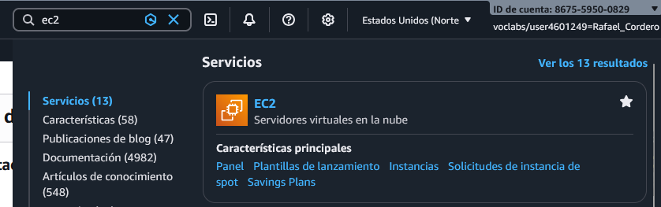

#### Paso 1 – Nombre

- Name: `ServidorWebMarisma`

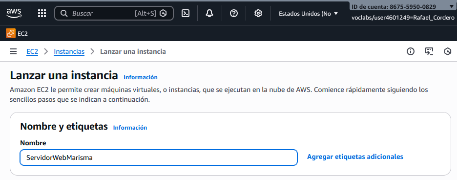

#### Paso 2 – AMI (Sistema Operativo)

- Selecciona **Ubuntu Server 22.04 LTS (Free Tier eligible)**

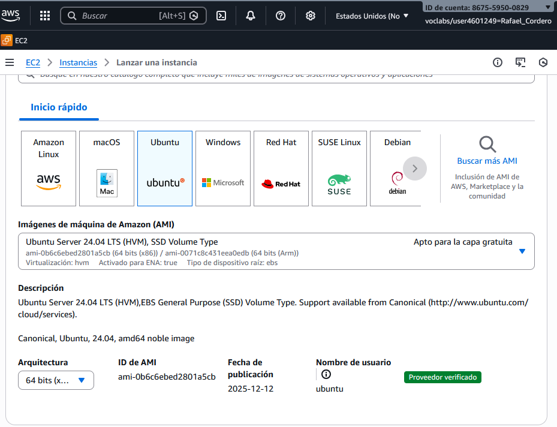

#### Paso 3 – Tipo de instancia

- Selecciona **t2.micro**

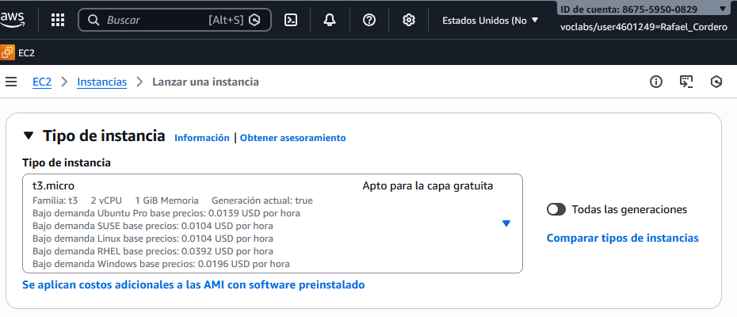

#### Paso 4 – Clave SSH

1. Create new key pair
2. Nombre: `marisma-key`
3. Tipo: RSA
4. Descargar el archivo `.pem`

⚠️ **No pierdas este archivo**, es la única forma de acceder por SSH.

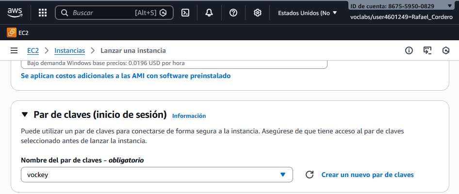

#### Paso 5 – Configuración de red (Security Group)

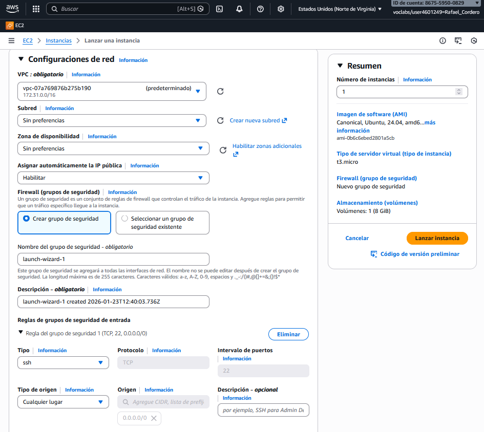

Crear un nuevo Security Group con las siguientes reglas **INBOUND**:

| Tipo  | Puerto     | Origen    |
| ----- | ---------- | --------- |
| SSH   | 22         | Tu IP     |
| HTTP  | 80         | 0.0.0.0/0 |
| HTTPS | 443        | 0.0.0.0/0 |
| FTP   | 21         | 0.0.0.0/0 |
| SFTP  | 22         | 0.0.0.0/0 |
| DNS   | 53 TCP/UDP | 0.0.0.0/0 |
| MySQL | 3306       | 127.0.0.1 |

#### Paso 6 – Almacenamiento

- 8–10 GB (por defecto)

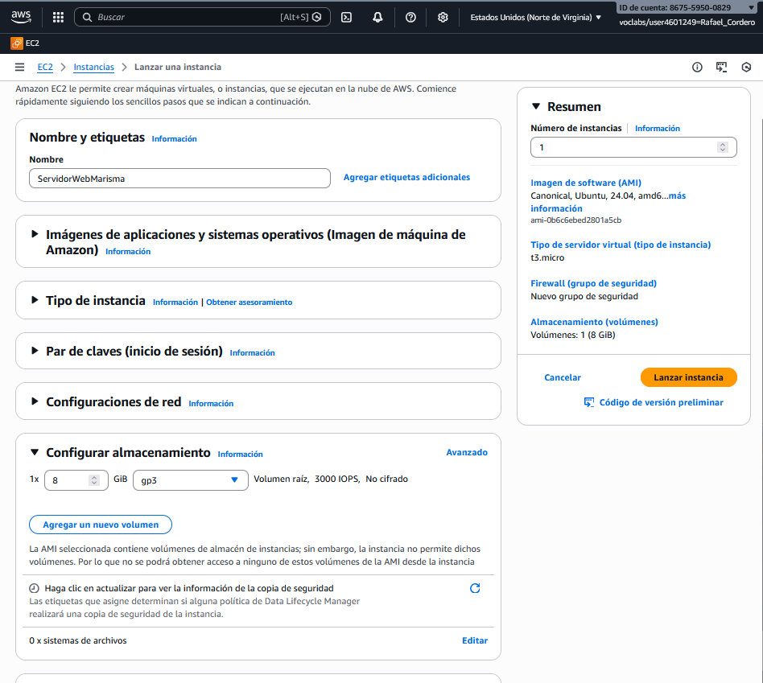

#### Paso 7 – Lanzar instancia

Pulsa **Launch instance**

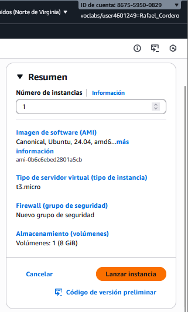

Ahora esperamos un poco

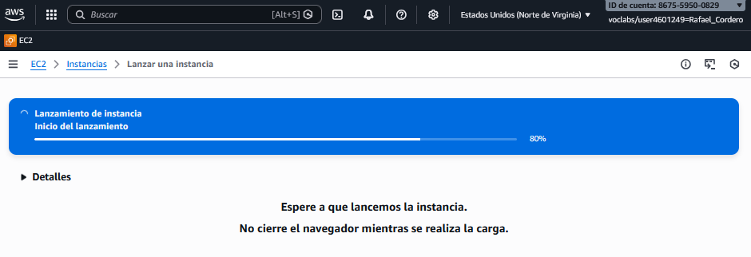
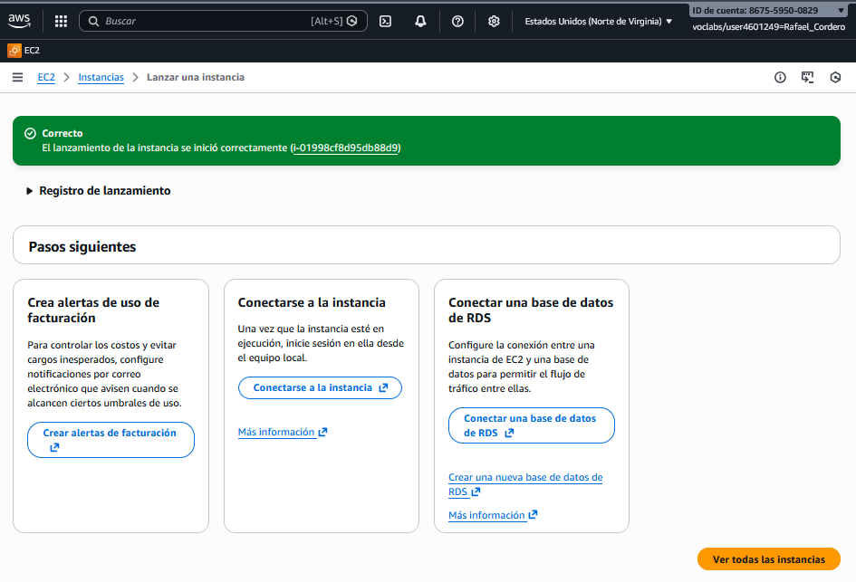

Nos saldrá la siguiente , le damos a Conectar
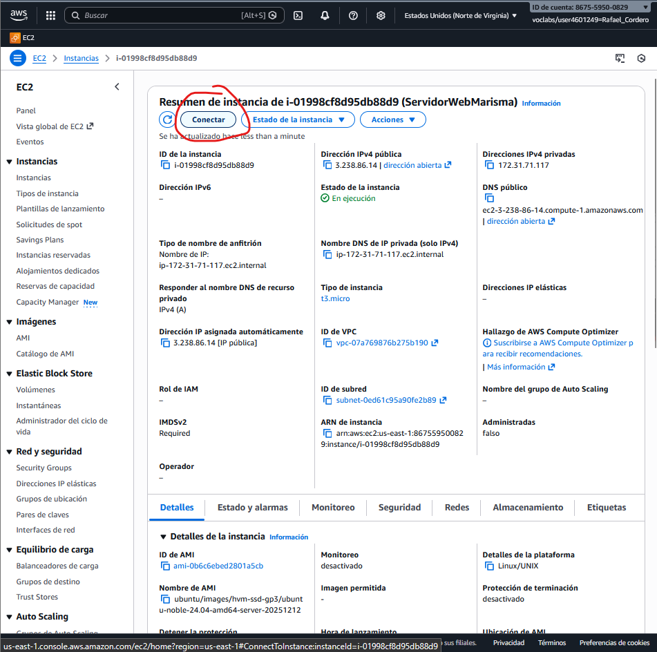
Y le damos a conectar
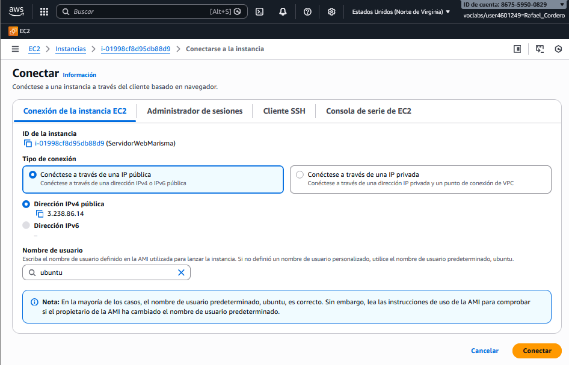

Y nos cargará lo siguiente
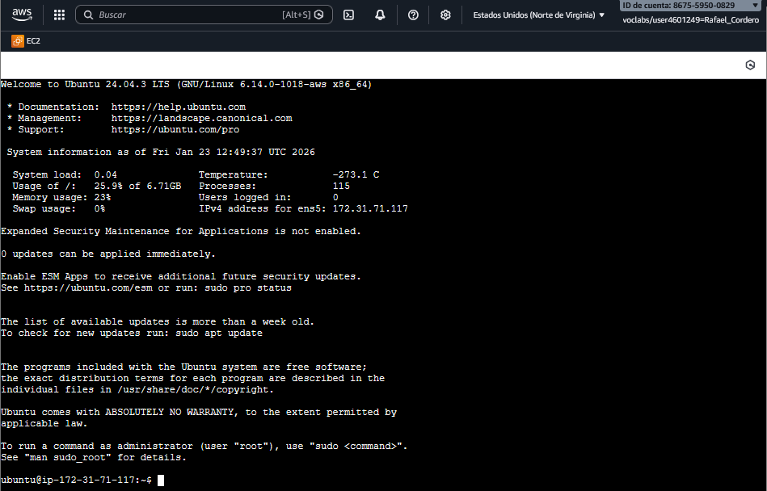

---

### 0.3 Conexión por SSH desde tu equipo

Desde la carpeta donde descargaste la clave:

```bash
chmod 400 marisma-key.pem
ssh -i marisma-key.pem ubuntu@IP_PUBLICA_EC2
```

> La IP pública se obtiene desde el panel de EC2

---

- Sistema Operativo: **Debian / Ubuntu Server**
- Servicios principales:
  - Apache2
  - PHP
  - MySQL / MariaDB
  - phpMyAdmin
  - Bind9 (DNS)
  - ProFTPD (FTP con TLS)
  - OpenSSH
  - Python3

> ⚠️ Todos los comandos deben ejecutarse como **root** o con `sudo`.

---

## 1️⃣ Instalación de servicios

```bash
apt update && apt upgrade -y
apt install apache2 php libapache2-mod-php php-mysql mysql-server \
phpmyadmin bind9 proftpd openssh-server python3 -y
```

Y empezamos a actualizar la maquina y instalar los servicios
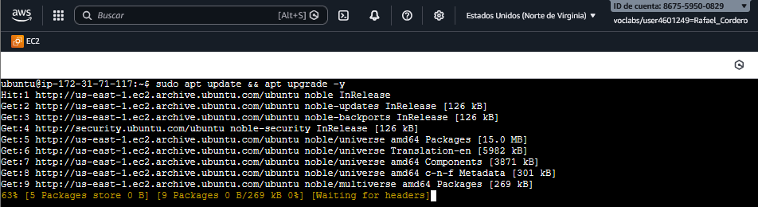

Instalamos ahora apache2 php y todas las cosas
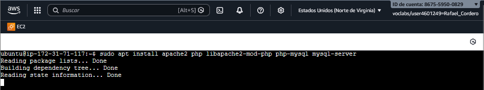

como vamos a instalar todo de uno esperamos un poco
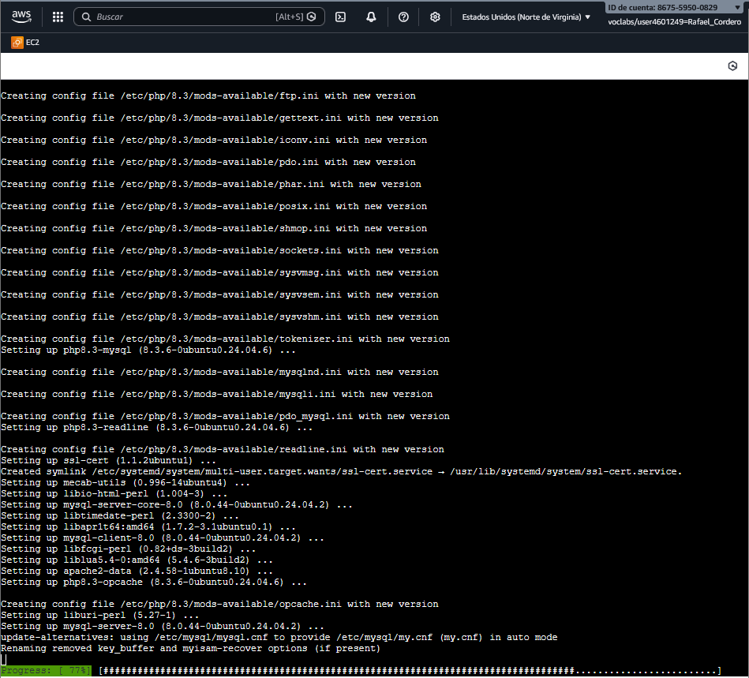

Ahora usamos el comando de phpmyadmin bind9 proftpd openssh-server python 3 -y para instalar todo de uno de nuevo
pero me sale command not found entonces vamos a activar el repositorio de universe para esto hacemos lo siguiente

```bash
sudo asdd-apt-repository universe
sudo apt update
```

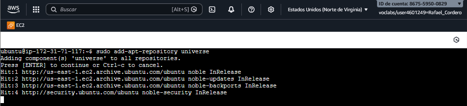
y ahora actualizamos
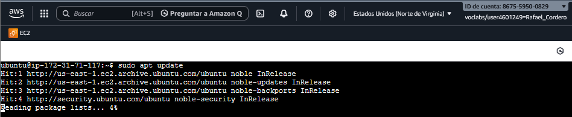


Ahora habilitamos los módulos necesarios en Apache:

```bash
a2enmod rewrite
systemctl restart apache2
```
Al ejecutar tenemos que tener las contraseñas a mano o nos sucederá esto:
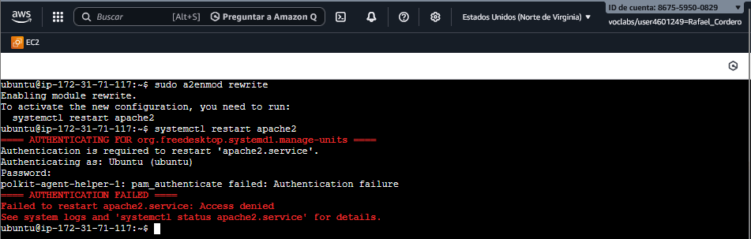	

como me estaba dando muchos problemas he decidido acceder por ssh desde mi terminal Warp a la máquina para esto simplemente nos tenemos que dirigir a nuestro panel del laboratorio y descargar el archivo que pone PEM 

Cogemos la ip publica de la maquina y al copiamos y ahora hacemos el ssh
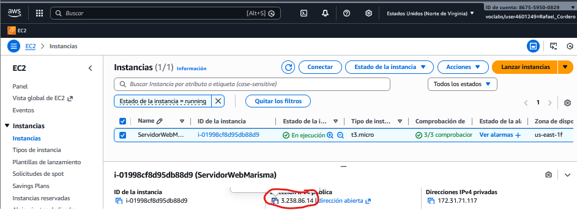

---

## 2️⃣ Configuración de Apache

- Directorio base de los clientes:

```bash
/var/www/html/
```

Cada cliente tendrá su propio **VirtualHost** y su propio `DocumentRoot`.

---

## 3️⃣ Configuración de MySQL y phpMyAdmin

Asegurar MySQL:

```bash
mysql_secure_installation
```

Acceder a MySQL:

```bash
mysql -u root -p
```

phpMyAdmin quedará accesible desde:

```
http://IP_SERVIDOR/phpmyadmin
```

---

## 4️⃣ Configuración del servidor DNS (Bind9)

### Zona principal

Archivo de zona:

```bash
/etc/bind/db.marisma.local
```

Ejemplo:

```dns
$TTL    604800
@       IN      SOA     ns.marisma.local. admin.marisma.local. (
                              2         ; Serial
                         604800         ; Refresh
                          86400         ; Retry
                        2419200         ; Expire
                         604800 )       ; Negative Cache TTL
;
@       IN      NS      ns.marisma.local.
ns      IN      A       192.168.1.10
```

---

## 5️⃣ Acceso FTP, SFTP y SSH

- FTP configurado con **ProFTPD + TLS**
- Acceso seguro por **SSH y SFTP** para cada usuario del sistema

Cada cliente será un **usuario del sistema**, con acceso restringido a su directorio.

---

## 6️⃣ Automatización mediante scripts

Toda la gestión de clientes se realizará mediante **scripts en Bash**.

### 🔹 Funcionalidades automatizadas

- Creación de usuario del sistema
- Creación del directorio web
- Creación del VirtualHost de Apache
- Creación de subdominio DNS (directa e inversa)
- Creación de base de datos y usuario MySQL
- Acceso por FTP / SSH / SFTP

---

## 7️⃣ Script: Creación de subdominio DNS

```bash
#!/bin/bash
# crear_subdominio.sh usuario ip

if [ $# -le 1 ]; then
  echo "Error. Introduce subdominio e IP"
  exit 1
fi

USER=$1
IP=$2
SUB_DOMAIN="${USER}.marisma.local"
ZONE_FILE="/etc/bind/db.marisma.local"

mkdir -p /var/www/html/$USER

cat <<EOF >> $ZONE_FILE
$ORIGIN ${SUB_DOMAIN}.
@   IN  A   ${IP}
www IN  A   ${IP}
EOF

systemctl reload bind9
systemctl reload apache2
```

---

## 8️⃣ Script: Creación de VirtualHost Apache

```bash
#!/bin/bash
# crear_vhost.sh usuario

USER=$1
CONF="${USER}.marisma.conf"
DOCROOT="/var/www/html/${USER}"
SUBDOMAIN="${USER}.marisma.local"

cat <<EOF > /etc/apache2/sites-available/$CONF
<VirtualHost *:80>
    ServerName www.$SUBDOMAIN
    DocumentRoot $DOCROOT

    <Directory $DOCROOT>
        AllowOverride All
        Require all granted
    </Directory>

    ErrorLog /var/log/apache2/${USER}_error.log
    CustomLog /var/log/apache2/${USER}_access.log combined
</VirtualHost>
EOF

a2ensite $CONF
systemctl reload apache2
```

---

## 9️⃣ Script: Creación de base de datos MySQL

```bash
#!/bin/bash
# crear_bd.sh usuario password

USER=$1
PASS=$2
DB="db_${USER}"

mysql -u root -p <<EOF
CREATE DATABASE $DB;
CREATE USER '$USER'@'localhost' IDENTIFIED BY '$PASS';
GRANT ALL PRIVILEGES ON $DB.* TO '$USER'@'localhost';
FLUSH PRIVILEGES;
EOF
```

---

## 🔟 Ejecución de aplicaciones Python

Instalar soporte WSGI:

```bash
apt install libapache2-mod-wsgi-py3 -y
a2enmod wsgi
systemctl restart apache2
```

Permite ejecutar aplicaciones Python desde Apache.

---

## 🐳 (Opcional) Docker – Hasta +10% nota

- Contenedor DNS (Bind9)
- Contenedor Web (Apache + PHP)
- Contenedor MySQL

Configuración mediante:

- `docker-compose.yml`
- Volúmenes persistentes
- Scripts de inicialización

---

## 📂 Entrega del trabajo

El repositorio debe incluir:

- README.md (este documento)
- Scripts Bash
- Presentación

Añadir como colaborador a:
👉 https://github.com/jpritin

📅 **Fecha límite:** 30 de abril

---

## 🎤 Exposición

Durante la exposición se explicará:

- Arquitectura del sistema
- Scripts utilizados
- Configuración de servicios
- Flujo completo de creación de un cliente

---

## 📚 Enlaces útiles

- https://bash.cyberciti.biz/domain/create-bind9-domain-zone-configuration-file/
- https://www.freeos.com/guides/lsst/scripts/AddDomain
- https://python-for-system-administrators.readthedocs.io/en/latest/
- https://www.shellscript.sh/index.html
