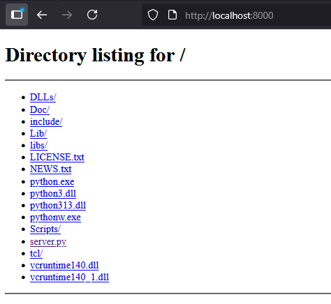
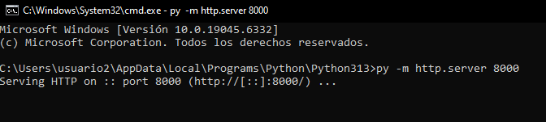
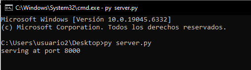

# 🌐 Despliegue de Aplicaciones Web

## 📋 Descripción
Este repositorio contiene ejercicios y prácticas relacionadas con el despliegue de aplicaciones web, enfocándose en la configuración y uso de servidores web básicos con Python.

## 🔧 Requisitos
- Python 3.x instalado
- Navegador web
- Conexión a internet para acceder a los recursos

## 📚 Recursos de referencia
- [Simple web server (Python)](https://docs.python.org/3/library/http.server.html)
- [HTTP Server Implementation](https://github.com/python/cpython/blob/main/Lib/http/server.py)
- [Dummy Web Server Example](https://gist.github.com/kabinpokhrel/6fd1275603e9d5f1e284be717cbd1bff)

## 🚀 Ejercicios realizados

### 📁 Ejercicio 1: Servidor HTTP básico

#### Pasos para realizar el ejercicio:
1. Abrir la línea de comandos (CMD)
2. Ejecutar el comando `python -m http.server 8000`
3. Acceder a la dirección `http://localhost:8000` en el navegador

### 📁 Ejercicio 2: Servidor personalizado

#### Pasos para realizar el ejercicio:
1. Copiar el código del enlace facilitado por el profesor
2. Abrir la línea de comandos (CMD)
3. Navegar a la ruta donde se encuentra el código
4. Ejecutar el archivo Python y verificar el funcionamiento del servidor

## 💡 Notas adicionales
- Para detener cualquier servidor, presionar `Ctrl+C` en la línea de comandos

