# 🌐 Despliegue de Aplicaciones Web

## 📋 Descripción

Este repositorio contiene ejercicios y prácticas relacionadas con el despliegue de aplicaciones web, enfocándose en la configuración y uso de servidores web básicos con Python.

## 🔧 Requisitos

- Python 3.x instalado
- Navegador web
- Conexión a internet para acceder a los recursos

## 📚 Recursos de referencia

- [Simple web server (Python)](https://docs.python.org/3/library/http.server.html)
- [HTTP Server Implementation](https://github.com/python/cpython/blob/main/Lib/http/server.py)
- [Dummy Web Server Example](https://gist.github.com/kabinpokhrel/6fd1275603e9d5f1e284be717cbd1bff)

## 🚀 Ejercicios realizados

### 📁 Ejercicio 1: Servidor HTTP básico

#### Pasos para realizar el ejercicio:

1. Abrir la línea de comandos (CMD)
2. Ejecutar el comando `python -m http.server 8000`
3. Acceder a la dirección `http://localhost:8000` en el navegador

### 📁 Ejercicio 2: Servidor personalizado

#### Pasos para realizar el ejercicio:

1. Copiar el código del enlace facilitado por el profesor
2. Abrir la línea de comandos (CMD)
3. Navegar a la ruta donde se encuentra el código
4. Ejecutar el archivo Python y verificar el funcionamiento del servidor

### 📁 Ejercicio 3: Instalación de Apache, MySQL y PHP

<!-- https://www.digitalocean.com/community/tutorials/how-to-install-linux-apache-mysql-php-lamp-stack-on-ubuntu-20-04-es#paso-4-crear-un-host-virtual-para-su-sitio-web -->

#### Paso 1: Instalación de Apache

1. Primero actualizamos nuestra máquina con apt update y upgrade
   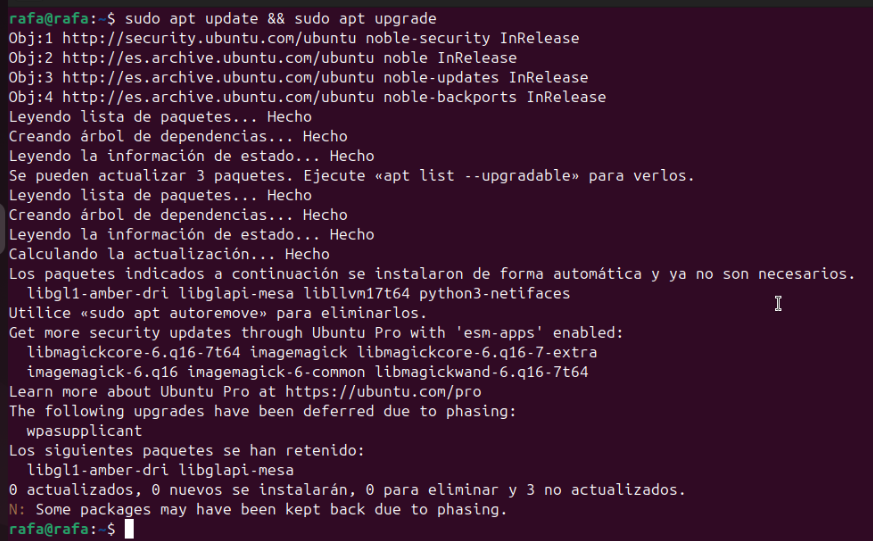

2. Ahora instalamos apache2
   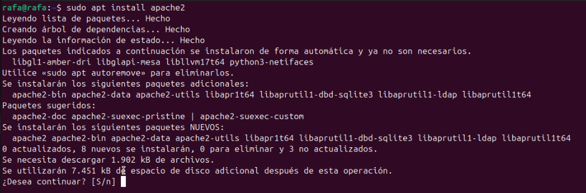

3. sudo ufw app list es para ver las aplicaciones disponibles en ufw
   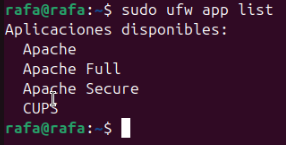

4. ahora ponemos sudo ufw allow in apache para permitir el tráfico entrante
   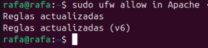

5. Y ahora vemos el estado, en nuestro caso nos sale desactivado, lo mantenemos
   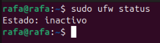

6. Ahora abrimos el navegador y vemos el localhost para verificar que se nos instaló bien el apache
   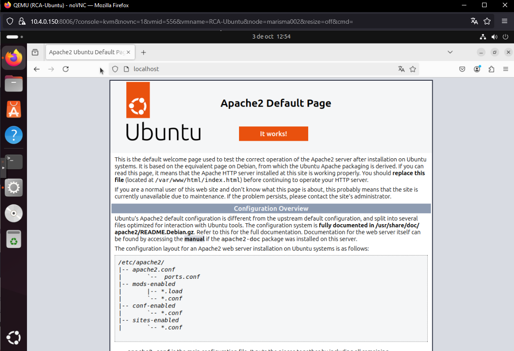

#### Paso 2: Instalación de MySQL

7. Ahora instalamos mysql-server
   

1. Descargamos mysql secure
   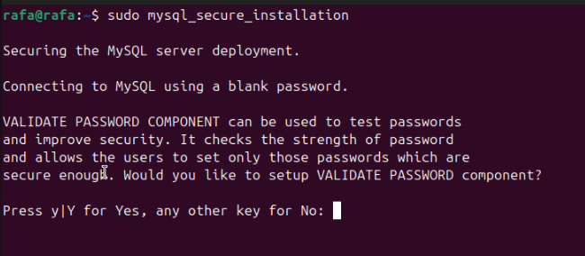

2. Ejecutamos mysql
   

3. Salimos con el comando exit
   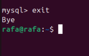

#### Paso 3: Instalación de MySQL

4. Instalamos PHP
   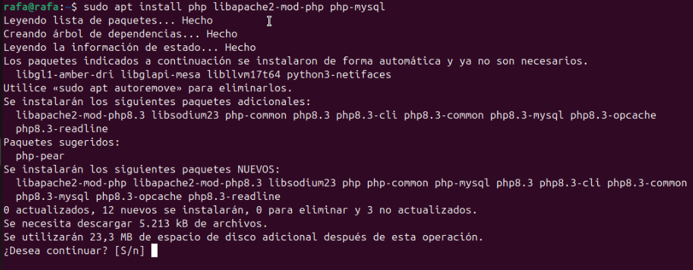

5. Verificamos la version de php
   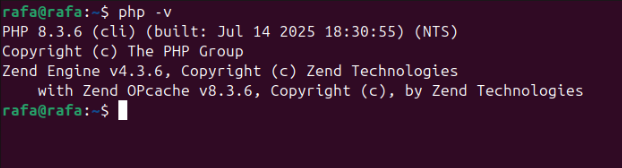

### Paso 4: Crear un host virtual para su sitio web

6. Creamos el directorio para your_domain de la siguiente manera:
   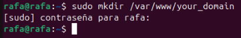

7. Ahora le asignamos la propiedad al directorio con la variable de entorno `$USER`, que hará referencia al usuario del sistema actual:
   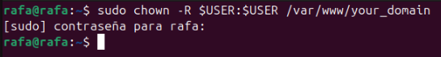

## 💡 Notas adicionales

- Para detener cualquier servidor, presionar `Ctrl+C` en la línea de comandos
- Para salir de mysql, usa el comando `exit`
- Para cerrar apache2, usa el comando `sudo service apache2 stop`
