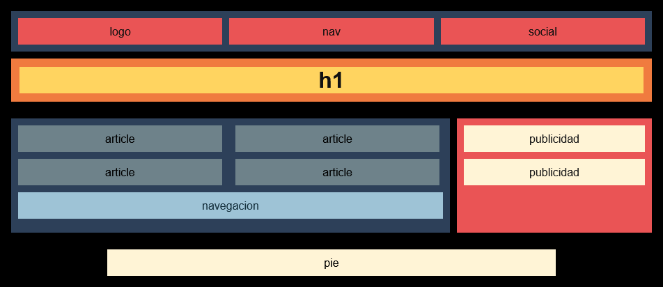
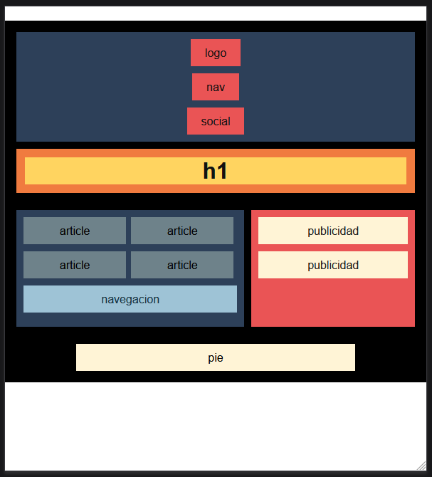
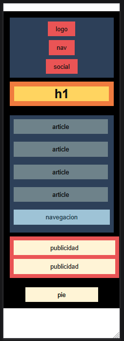

# Media Queries (Responsive)

Si la ventana se achica, los estilos cambian solos.

Aquí uso dos límites:

- Cuando la pantalla mide 600 px o menos, la cabecera se pone en columna: el logo arriba y el menú abajo, así se lee mejor en el móvil.  
- Si se estrecha hasta 300 px, el contenido y la barra lateral se apilan uno debajo del otro, como bloques de Lego.

Ejemplo del código usado:

```css
@media screen and (max-width: 600px) {
  .header__content {
    display: flex;
    flex-direction: column;
    gap: 10px;
  }
}

@media screen and (max-width: 300px) {
  .section {
    display: flex;
    flex-direction: column;
    gap: 10px;
  }
  .section__content {
    display: flex;
    flex-direction: column;
    gap: 10px;
  }
  .aside {
    display: flex;
    flex-direction: column;
    gap: 10px;
  }
}
```

Vista final:

<p align="center">
  
  
  
</p>
