Usa el display de tipo grid para conseguir los siguientes diseños  
Los elementos con el texto celda 1, celda 2... son bloques div que irán escritos en ese orden y con una clase que alinea el texto al centro. El gap o separación entre celdas es de 1px. 

## Ejercicio 1

| Resultado | Esquema |
|:---------:|:-------:|
| 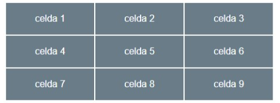 | 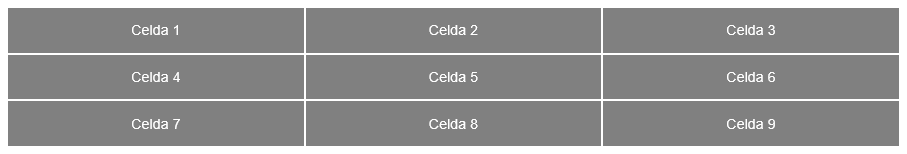 |

| HTML | CSS |
|:----:|:---:|
| 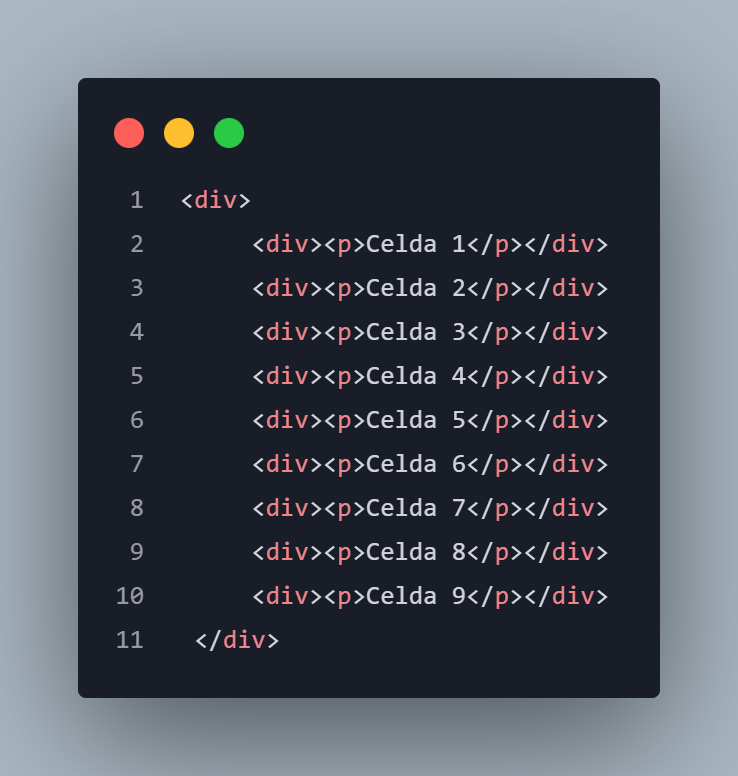 | 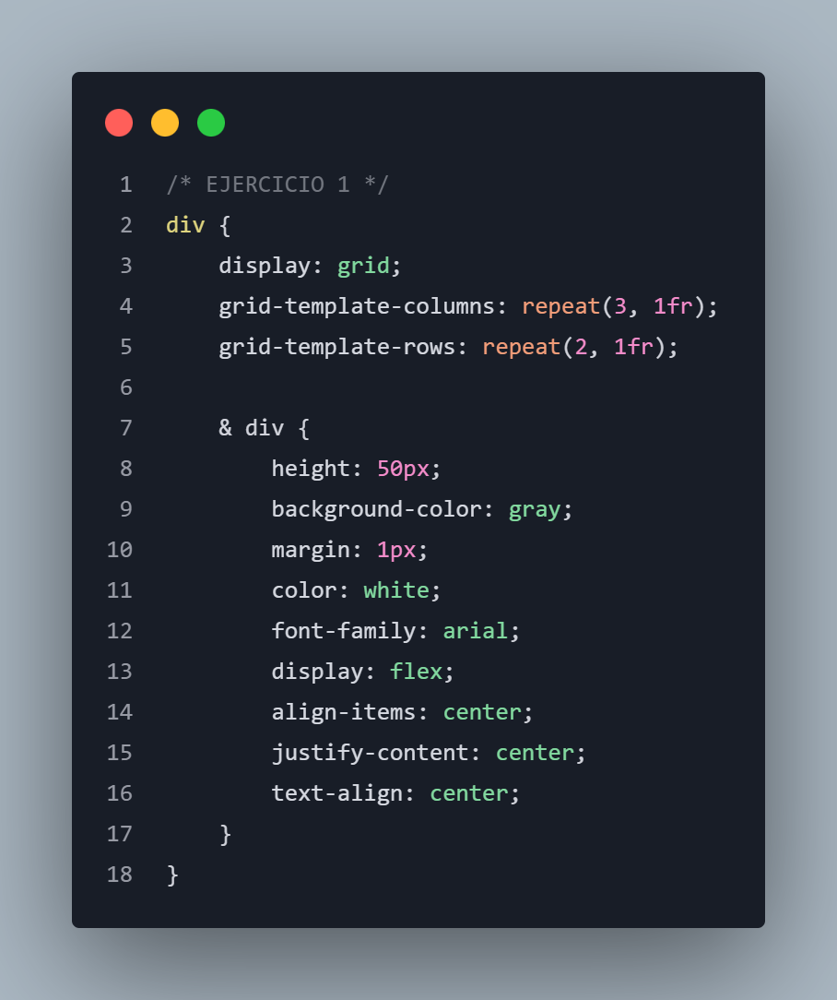 |

## Ejercicio 2

| Resultado | Esquema |
|:---------:|:-------:|
| 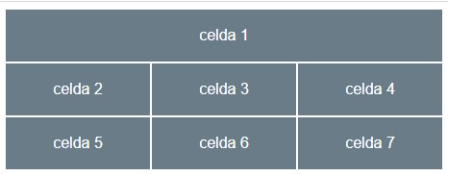 | 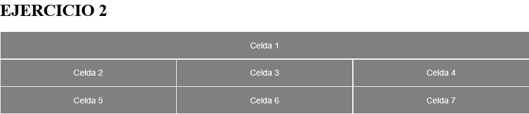 |

| HTML | CSS |
|:----:|:---:|
| 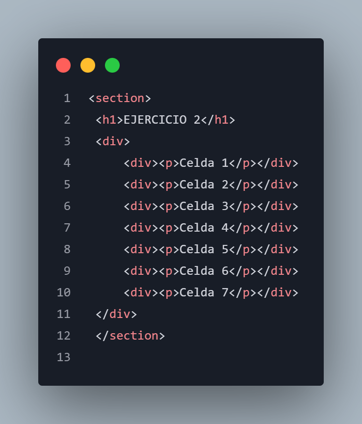 | 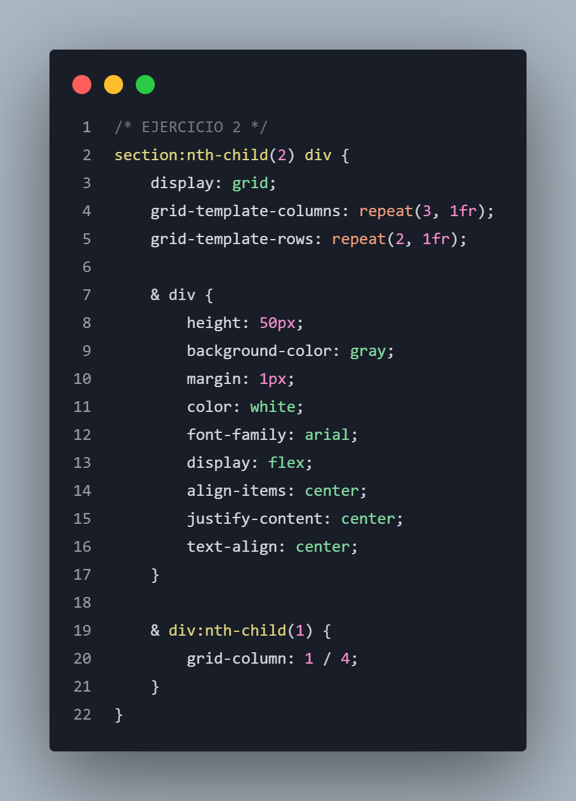 |

## Ejercicio 3

| Resultado | Esquema |
|:---------:|:-------:|
| 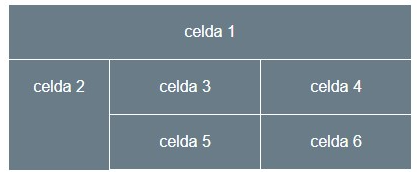 | 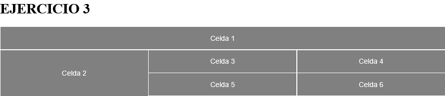 |

| HTML | CSS |
|:----:|:---:|
| 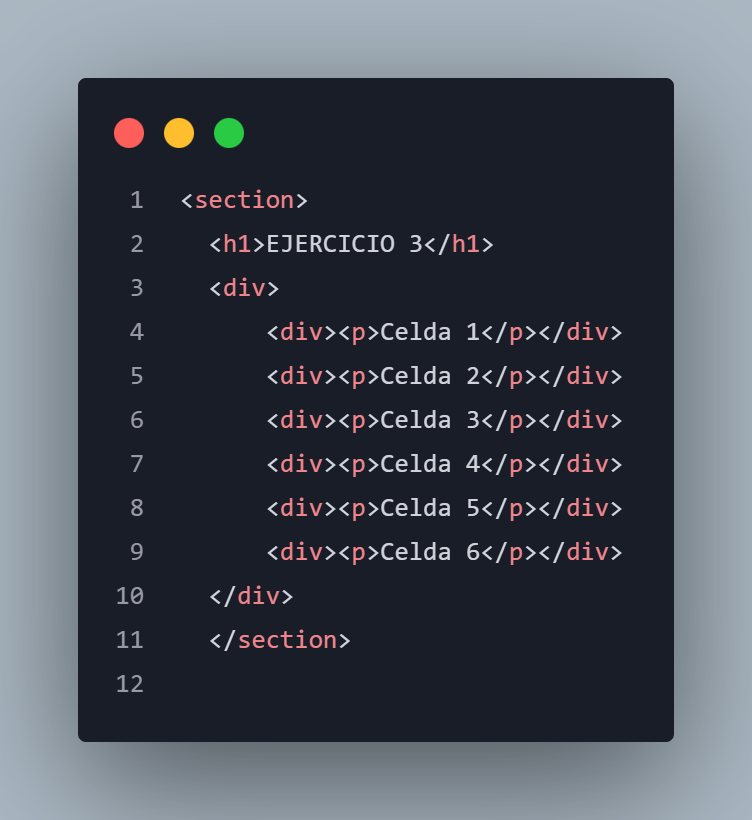 | 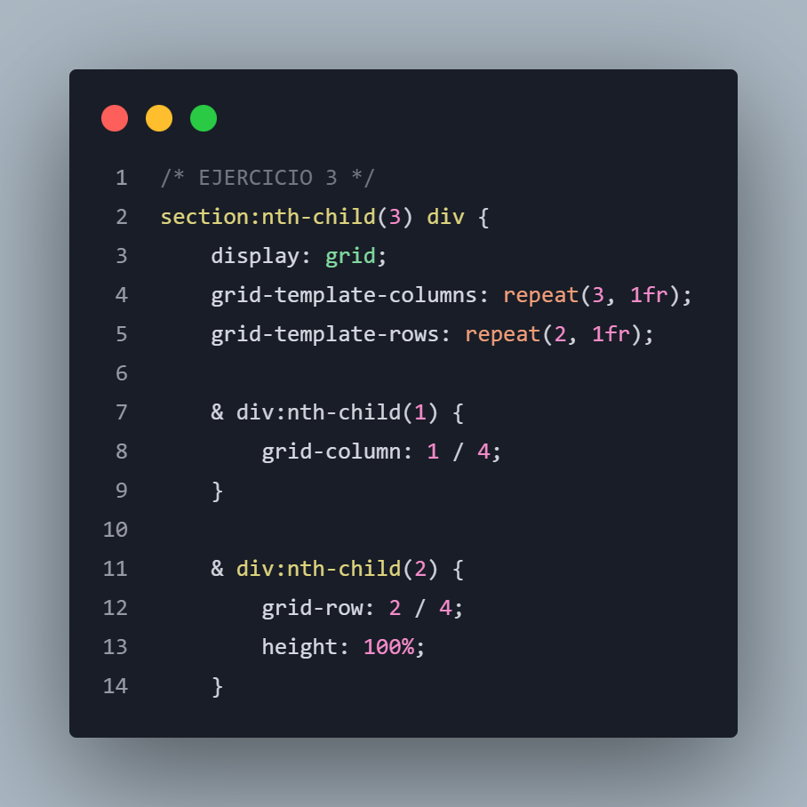 |

## Ejercicio 4 (usa grid area)

| Resultado | Esquema |
|:---------:|:-------:|
| 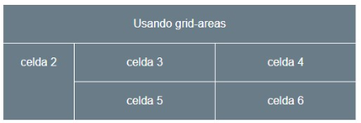 | 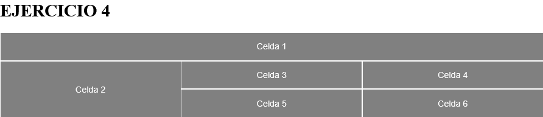 |

| HTML | CSS |
|:----:|:---:|
| 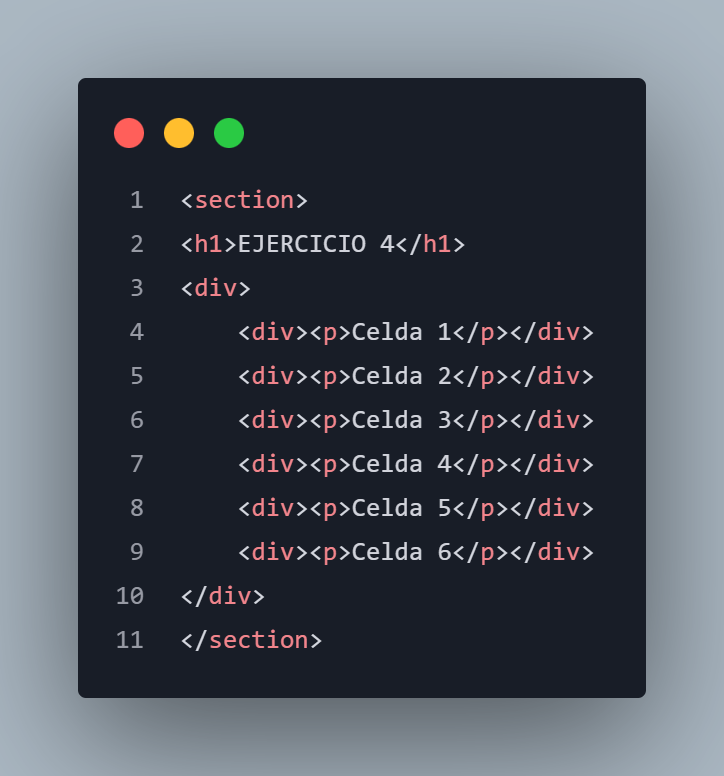 | 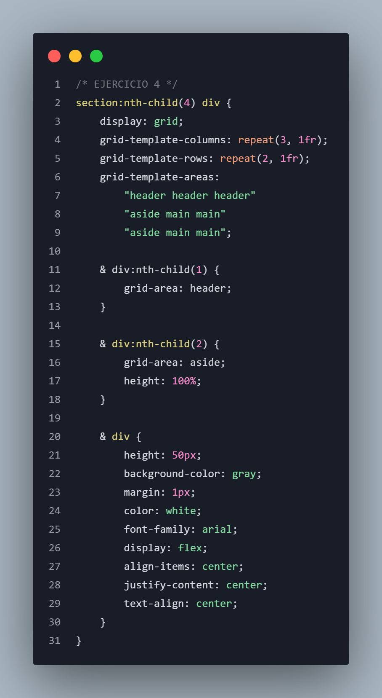 |