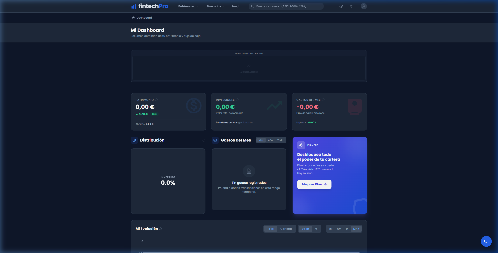
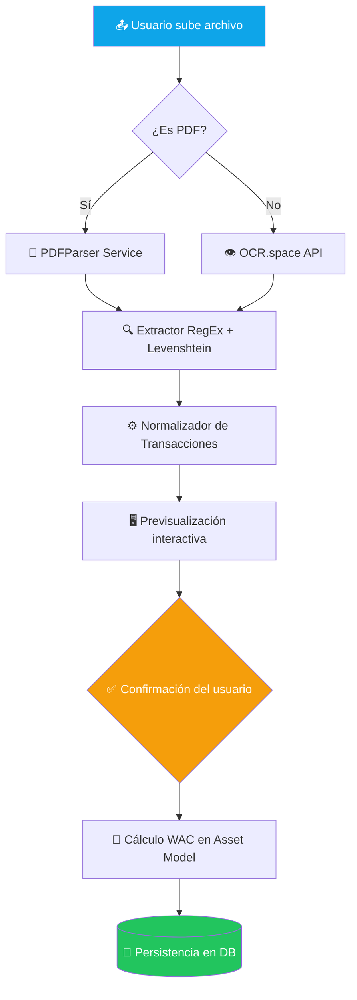
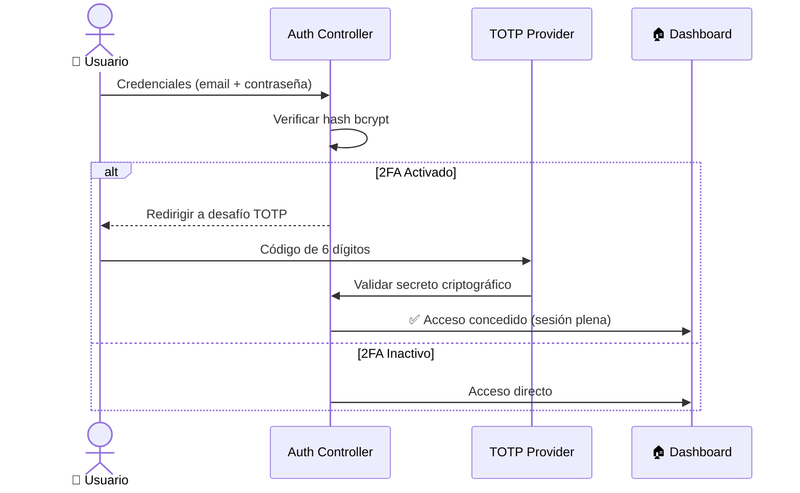

<div align="center">


<br/><br/>

```
███████╗██╗███╗   ██╗████████╗███████╗ ██████╗██╗  ██╗    ██████╗ ██████╗  ██████╗
██╔════╝██║████╗  ██║╚══██╔══╝██╔════╝██╔════╝██║  ██║    ██╔══██╗██╔══██╗██╔═══██╗
█████╗  ██║██╔██╗ ██║   ██║   █████╗  ██║     ███████║    ██████╔╝██████╔╝██║   ██║
██╔══╝  ██║██║╚██╗██║   ██║   ██╔══╝  ██║     ██╔══██║    ██╔═══╝ ██╔══██╗██║   ██║
██║     ██║██║ ╚████║   ██║   ███████╗╚██████╗██║  ██║    ██║     ██║  ██║╚██████╔╝
╚═╝     ╚═╝╚═╝  ╚═══╝   ╚═╝   ╚══════╝ ╚═════╝╚═╝  ╚═╝    ╚═╝     ╚═╝  ╚═╝ ╚═════╝
```

### Gestión Patrimonial Inteligente — Automatizada. Segura. Completa.

**Consolida acciones, ETFs, criptomonedas, fondos y cash en una única plataforma de grado profesional.**  
Automatización con OCR · Web Scraping resiliente · 2FA real · Analytics avanzado

<br/>

[🚀 Demo en vivo](#) · [📖 Documentación](#arquitectura) · [🐛 Reportar un Bug](../../issues) · [💡 Proponer Feature](../../issues)

</div>

---

## 📋 Tabla de Contenidos

- [¿Por qué FintechPro?](#-por-qué-fintechpro)
- [Capturas de Pantalla](#-capturas-de-pantalla)
- [Stack Tecnológico](#-stack-tecnológico)
- [Arquitectura](#-arquitectura)
- [Funcionalidades](#-funcionalidades)
- [Instalación](#-instalación)
- [Credenciales Demo](#-credenciales-de-acceso-demo)
- [Seguridad](#-seguridad)
- [Roadmap](#-roadmap)
- [Contribuir](#-contribuir)

---

## 💡 ¿Por qué FintechPro?

Tener activos en tres brokers, dos bancos y un exchange de criptomonedas es la norma hoy. La pregunta — *"¿cuánto tengo realmente?"* — no debería requerir una hora de trabajo manual.

**FintechPro** automatiza por completo esa consolidación: lee extractos bancarios en PDF, interpreta capturas de pantalla de brókers mediante OCR y obtiene precios de mercado en tiempo real desde múltiples fuentes. El resultado es un cuadro de mando unificado con la precisión financiera que merecen tus decisiones de inversión.

> *"De script personal para leer un Excel a plataforma de gestión financiera de grado profesional."*

---

## 🖼️ Capturas de Pantalla

<div align="center">

| Dashboard Principal | Security Hub | Analytics |
|:---:|:---:|:---:|
|  |  |  |
| KPIs globales y patrimonio | 2FA, sesiones y geolocalización | Distribución sectorial |

</div>

---

## 🛠️ Stack Tecnológico

<div align="center">

| Capa | Tecnología | Justificación |
|:---|:---|:---|
| **Backend** | Laravel 12 | ORM Eloquent, colas robustas, políticas de acceso |
| **Frontend** | Vue 3 + Inertia.js | SPA sin API REST separada, composables reutilizables |
| **Base de Datos** | MySQL / SQLite | Esquema relacional íntegro con integridad referencial total |
| **OCR** | OCR.space API | Extracción de transacciones desde capturas de brókers |
| **PDF** | smalot/pdfparser | Parsing estructurado de extractos bancarios |
| **Scraping** | Guzzle + DomCrawler | Motor de precios con fallbacks en cascada |
| **2FA** | pragmarx/google2fa | TOTP estándar RFC 6238 + QR codes |
| **Gráficos** | Chart.js + vue-chartjs | Pie charts y telemetría financiera en tiempo real |
| **DevOps** | Docker + Docker Compose | PHP-FPM, Nginx, Queue Workers orquestados |

</div>

---

## 🏗️ Arquitectura

### Patrones de Diseño Aplicados

FintechPro no es un conjunto de scripts. Está construido bajo estándares de ingeniería senior para garantizar escalabilidad y mantenibilidad a largo plazo.

| Patrón | Implementación |
|:---|:---|
| **Service Layer** | Lógica de negocio aislada en `app/Services` — controladores limpios y enfocados |
| **Strategy & Factory** | El motor de datos decide en tiempo real: API Premium → Scraping → Proveedor de respaldo |
| **Adapter** | Normalización de respuestas heterogéneas (OCR.space, PDFParser) al esquema interno |
| **Middleware Chain** | Validación 2FA y protección de integridad de sesión en capas encadenadas |
| **Composition (Vue 3)** | Lógica reactiva encapsulada en Composables: `useAssetTable`, `useTransactionForm` |
| **Feature-based Architecture** | Componentes organizados por dominio funcional, no por tipo de archivo |

---

### Flujo de Importación OCR / PDF



---

### Flujo de Autenticación 2FA (TOTP — RFC 6238)



---

### Modelo de Datos

```
User ──────────────────────────────────────────────────────────┐
 │                                                              │
 │ 1:N                                                          │
 ▼                                                              │
Portfolio ─────────────────────────────────────────────────────┤
 │   [Trading · Dividendos · Indexados · ...]                   │
 │                                                              │
 │ 1:N                                                          │
 ▼                                                              │
Asset ─────────── Acciones · ETFs · Cripto · Fondos · Cash     │
 │   ▲                                                          │
 │   └─── MarketData (Ticker: AAPL, BTC, MSFT...)  ◄───────────┘
 │
 │ 1:N
 ▼
Transaction ─── cost_basis · balance · WAC · TWR · splits
```

---

### Controladores y Responsabilidades

| Área | Controlador | Responsabilidad |
|:---|:---|:---|
| **Núcleo** | `DashboardController` | Orquestación de KPIs globales y estado patrimonial |
| **Operativa** | `TransactionController` | CRUD de movimientos y cálculo de plusvalías |
| **Importación** | `PortfolioController` | Procesamiento OCR, PDF y vinculación manual |
| **Inteligencia** | `AnalystController` | Integración con IA para informes de cartera |
| **Administración** | `AdminController` | Telemetría, monitorización de APIs y backups |
| **Social** | `FamousPortfolioController` | Gurús, carteras 13F y análisis sectorial |
| **Comunidad** | `SocialController` | Feed, posts y engagement de usuarios |
| **Seguridad** | `SecurityController` | 2FA, auditoría de sesiones y actividad |
| **Soporte** | `SupportController` | Ticketing omnicanal y flujo de resolución |

---

## ✨ Funcionalidades

<details>
<summary><strong>💼 Gestión Patrimonial</strong></summary>

- Soporte multi-clase de activo: **Acciones, ETFs, Criptomonedas, Fondos y Cash**
- Cálculo automático de **Coste Promedio Ponderado (WAC)** con soporte a splits y dividendos
- **TWR (Time-Weighted Return)** para rentabilidades ponderadas al tiempo
- Agrupación por divisas con normalización de tipos de cambio en tiempo real
- Dashboard con KPIs: P/L total, rentabilidad anualizada, exposición sectorial

</details>

<details>
<summary><strong>🤖 Automatización Vision-to-Data</strong></summary>

- **OCR de capturas de pantalla** de brókers (Degiro, Interactive Brokers, eToro...)
- **PDF Parser** de extractos bancarios con reconocimiento de patrones financieros
- Motor de limpieza con **distancia de Levenshtein** para corregir errores OCR (`8`↔`B`, `0`↔`O`)
- Previsualización y confirmación antes de persistir cualquier dato

</details>

<details>
<summary><strong>📡 Precios de Mercado — Scraping Resiliente</strong></summary>

Sistema de **Fallbacks en Cascada** con cuatro niveles de resiliencia:

1. **API Premium** (EODHD) — fuente primaria
2. **Web Scraping** (Morningstar) — XPath específico como respaldo
3. **Proveedor alternativo** (CoinGecko / Yahoo Finance) — tercer nivel
4. **Precio anterior** — marcado como `⚠️ Requiere Revisión` si todo falla

</details>

<details>
<summary><strong>🛡️ Security Hub</strong></summary>

- **2FA real (TOTP)** basado en RFC 6238 con vinculación por código QR
- **Auditoría de sesiones**: IP, User-Agent, geolocalización y Session ID
- Detección de sesiones activas simultáneas y prevención de hijacking
- **Modo Privacidad**: oculta cifras sensibles en entornos públicos
- Políticas de acceso (`PortfolioPolicy`) que garantizan aislamiento total entre usuarios

</details>

<details>
<summary><strong>🌐 Social Hub</strong></summary>

- Feed de comunidad con posts e interacción entre inversores
- **Seguimiento de carteras 13F** (gurús institucionales: Buffett, Ackman, Lynch...)
- Rankings de inversores y análisis de tendencias sectoriales
- Democratización del acceso a estrategias de gestores profesionales

</details>

<details>
<summary><strong>⚙️ Admin Center</strong></summary>

- Snapshots de base de datos desde la interfaz web
- Monitorización del estado de APIs externas en tiempo real
- Sistema de **ticketing de soporte omnicanal** con gestión de estados
- Telemetría del sistema y logs de errores de scraping

</details>

---

## 🚀 Instalación

### Requisitos Previos

```
PHP       >= 8.2     + Composer
Node.js   >= 18      + NPM
SQLite o MySQL
API Key   → OCR.space (gratuita en ocr.space)
```

### Pasos

```bash
# 1. Clonar el repositorio
git clone https://github.com/tu-usuario/fintechpro.git
cd fintechpro

# 2. Instalar dependencias
composer install
npm install

# 3. Configurar el entorno
cp .env.example .env
php artisan key:generate
# → Edita .env: DB_*, OCR_SPACE_API_KEY, etc.

# 4. Migrar y sembrar la base de datos
php artisan migrate --seed
# Los activos reales de mercado se inyectan automáticamente.

# 5. Lanzar servidores de desarrollo (dos terminales)
php artisan serve
npm run dev
```

### Docker (Producción)

```bash
docker-compose up -d
```

Orquesta automáticamente: **PHP-FPM · Nginx · Queue Workers**

---

## 🔑 Credenciales de Acceso Demo

| Rol | Email | Contraseña | Notas |
|:---|:---|:---|:---|
| **Administrador** | `admin@fintechpro.com` | `admin1234` | Acceso total al Admin Center |
| **Usuario Pro** | `test@example.com` | `password1234` | Cartera con 5 años de historial real |

> ⚠️ **No usar estas credenciales en producción.** Ejecuta `php artisan tinker` para crear tu usuario administrador personalizado.

---

## 🔒 Seguridad

FintechPro aplica múltiples capas de protección:

- **SQL Injection & XSS**: protección por defecto vía Laravel + Eloquent
- **CSRF**: tokens por sesión en todos los formularios
- **2FA TOTP** (RFC 6238): secretos criptográficos por usuario, nunca almacenados en texto plano
- **Session Auditing**: IP + UserAgent + Ubicación registrados en cada login
- **Políticas de acceso**: `PortfolioPolicy` garantiza que ningún usuario pueda acceder a datos de otro
- **Sanitización OCR**: validación y normalización antes de cualquier persistencia

Para reportar vulnerabilidades de seguridad, por favor usa la vía privada: [security@fintechpro.com](mailto:security@fintechpro.com)

---

## 🗺️ Roadmap

```
✅  Fase 1 — Cimentación          VILT stack · WAC engine · KPI Dashboard
✅  Fase 2 — Automatización       OCR real · PDF Parser · Scraping con fallbacks
✅  Fase 3 — Seguridad & Social   2FA TOTP · Auditoría de sesiones · Feed · Gurús 13F
🔄  Fase 4 — Optimización         Feature-based architecture · Vue Composables · Landing premium
⬜  Fase 5 — Futuro
     ├─ 📱 Mobile App             Capacitor → iOS / Android nativo
     ├─ 🏦 Open Banking          Integración PSD2 con APIs bancarias oficiales
     ├─ ⚖️  Rebalanceo Inteligente  Alertas por desviación de pesos objetivo
     └─ 🧾 Simulador Fiscal       Cálculo proactivo de plusvalías realizadas
```

---

## 📊 Estado del Proyecto

```
Complejidad de componentes     ████████████░░░  Reducida –55% (atomización de UI)
Mantenibilidad                 ████████████████  Alta (Composables + Services)
Cobertura de tests             ████████░░░░░░░░  En expansión (capa Services)
Deuda técnica                  ██░░░░░░░░░░░░░░  Baja y documentada
```

---

## 🤝 Contribuir

Las contribuciones son bienvenidas. Por favor, sigue el flujo estándar:

```bash
# 1. Fork del repositorio
# 2. Crear una rama para tu feature
git checkout -b feature/nombre-de-la-feature

# 3. Commit con mensajes descriptivos
git commit -m "feat: descripción clara del cambio"

# 4. Push y abrir Pull Request
git push origin feature/nombre-de-la-feature
```

Consulta [CONTRIBUTING.md](CONTRIBUTING.md) para las guías de estilo de código y convenciones de commits.

---

## 📄 Licencia

Distribuido bajo la licencia **MIT**. Consulta [`LICENSE`](LICENSE) para más información.

---

<div align="center">

Desarrollado con 🧠 y ☕ por **Rafael** — *Desarrollo de Aplicaciones Web (DAW)*

<br/>

*"La diferencia entre el caos financiero y la claridad es un sistema bien diseñado."*

<br/>

[](https://github.com/tu-usuario)
[](https://linkedin.com/in/tu-perfil)

</div>
