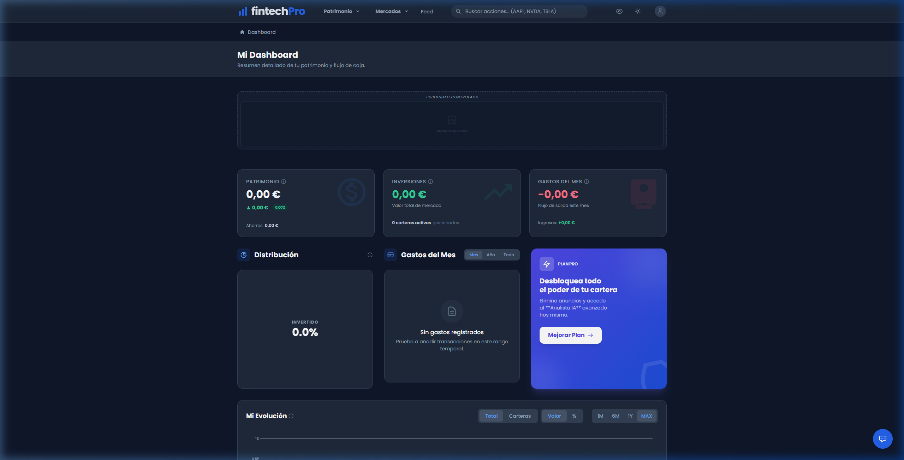

# 🚀 3eva Rosa

Este documento detalla el cumplimiento de cada requisito del proyecto mediante enlaces directos al código fuente y explicaciones técnicas detalladas para facilitar su revisión por parte de la profesora.

👉 **[Enunciado del Proyecto (PDF)](./app/Proyecto.pdf)**

---

## 📋 Parte 1: Planificación

### Entregables de Gestión
*   **Tablero de Organización:** [README.md#️-roadmap](./README.md#️-roadmap)  
    *💬 Planificación estratégica dividida en 5 fases cronológicas para asegurar el cumplimiento de plazos.*
*   **Sistema de Versiones (GitHub):** [Repositorio Raíz](./)  
    *💬 Uso de Git para el control de versiones. Estrategia de ramas (`main` y `feature/*`) para un desarrollo organizado.*
*   **Gestión de Activos Multimedia:** [resources/multimedia/](./resources/multimedia/)  
    *💬 Estructura organizada que separa archivos en bruto (`original/`) de los listos para web (`optimized/`).*

---

## 🎨 Parte 2: Creación

### 📱 Sistema de Rejilla y Breakpoints (Tailwind)
La aplicación utiliza un sistema de **rejilla responsiva** basado en utilidades de Tailwind. A continuación se explican las clases clave utilizadas en la vista principal [Welcome.vue](./resources/js/Pages/Welcome.vue):

| Clase | Breakpoint | Explicación para la Profesora |
| :--- | :--- | :--- |
| **`grid`** | General | Activa el modelo CSS Grid en el contenedor. |
| **`grid-cols-1`** | Móvil (<768px) | Configuración por defecto: los elementos se apilan en una sola columna. |
| **`md:grid-cols-2`** | Tablet (≥768px) | [Línea 127](./resources/js/Pages/Welcome.vue#L127): La rejilla de "Features" pasa a 2 columnas automáticamente. |
| **`lg:grid-cols-3`** | Desktop (≥1024px) | [Línea 127](./resources/js/Pages/Welcome.vue#L127): La rejilla se expande a 3 columnas para aprovechar el ancho de pantalla. |
| **`lg:grid-cols-2`** | Desktop (≥1024px) | [Línea 46](./resources/js/Pages/Welcome.vue#L46): En el Hero, el texto y la imagen se colocan uno al lado del otro. |
| **`gap-12`** | General | Define una separación uniforme de 3rem entre los elementos de la rejilla. |

### 🧩 Componentes Modulares (BaseUI)
Siguiendo la metodología de diseño atómico, los componentes base se encuentran centralizados en la carpeta **`BaseUI`**. Estos componentes son reutilizables y mantienen la consistencia visual de toda la plataforma:

*   **[ApplicationLogo.vue](./resources/js/Components/BaseUI/ApplicationLogo.vue):** Identidad visual centralizada (SVG optimizado).
*   **[Modal.vue](./resources/js/Components/BaseUI/Modal.vue):** Estructura base para diálogos interactivos, gestionando accesibilidad y transiciones.
*   **[TextInput.vue](./resources/js/Components/BaseUI/TextInput.vue):** Componente de entrada de datos con validación y estilos de foco (`focus:ring`).
*   **[PrimaryButton.vue](./resources/js/Components/BaseUI/PrimaryButton.vue):** Estilo de botón principal con estados `hover` y `disabled` unificados.

---

## 🖌️ Estilos Avanzados (SASS/SCSS)

Se ha integrado un preprocesador SASS para gestionar estilos que requieren mayor complejidad lógica que las clases utilitarias de Tailwind.

*   **Archivo Fuente:** [resources/css/custom.scss](./resources/css/custom.scss)
*   **Contenido Técnico Clave:**
    *   **Variables ($):** Centralización de colores de marca y tiempos de transición ([Líneas 5-7](./resources/css/custom.scss#L5-L7)).
    *   **Mixins (@mixin):** Implementación de efectos de elevación reutilizables mediante `elevation-hover` ([Líneas 10-16](./resources/css/custom.scss#L10-L16)).
    *   **Encapsulación:** Clase `.custom-card-interactive` que aplica el mixin ([Líneas 19-25](./resources/css/custom.scss#L19-L25)).
    *   **Estilos de Navegador:** Personalización del scrollbar mediante selectores `-webkit-scrollbar` ([Líneas 28-42](./resources/css/custom.scss#L28-L42)).

---

## 🔍 Marketing, Analítica y SEO Avanzado

El proyecto integra herramientas profesionales para la monitorización de tráfico, monetización y posicionamiento.

*   **Google Analytics (GA4):** [app.blade.php#L4](./resources/views/app.blade.php#L4)  
    *💬 Integración del script `gtag.js` para el seguimiento de eventos y comportamiento de usuarios.*
*   **Google Search Console:** Verificación mediante el tag de Analytics para monitorizar el indexado y CTR en las SERPs de Google.
*   **Google AdSense:** [Carpeta de Componentes](./resources/js/Components/Features/AdSense/)  
    *💬 Implementación de bloques de anuncios dinámicos (`AdSlot.vue`) y sistema de detección de AdBlock (`AdBlockDetector.vue`).*
*   **Looker Studio:** Conexión de los datos de Analytics para la creación de cuadros de mando y visualización de KPIs de rendimiento.
*   **SEO Técnico:** Jerarquía de encabezados semántica y optimización de velocidad (LCP < 2.5s) validada en [memoria.md](./docs/memoria.md).

---

## 🖼️ Parte 3 y 4: Multimedia e Interactividad

### Contenido Optimizado

*   **Multimedia Optimizado:** [resources/multimedia/optimized/](./resources/multimedia/optimized/)  
    *💬 Uso de formatos **WebP** y **SVG** para garantizar cargas ultra-rápidas.*
*   **Justificación:** [docs/manual_buenas_practicas_multimedia.md](./docs/manual_buenas_practicas_multimedia.md)

---

## ♿ Parte 5: Accesibilidad y Usabilidad

### Diseño Inclusivo
*   **Accesibilidad ARIA:** [Modal.vue#L12](./resources/js/Components/BaseUI/Modal.vue)  
    *💬 Uso de `role="dialog"` y `aria-modal` para garantizar que la web sea navegable por lectores de pantalla.*
*   **Feedback Visual (Focus):** [TextInput.vue#L18](./resources/js/Components/BaseUI/TextInput.vue)  
    *💬 El uso de `focus:ring-blue-500` asegura que los usuarios que navegan con teclado sepan exactamente dónde están.*

---

## ✅ Rúbricas de Evaluación (Rellenadas)

### Anexo 2: Rúbrica de Accesibilidad Web
| Criterio | Cumplimiento | Evidencia Técnica / Observación |
| :--- | :---: | :--- |
| **1. Texto Alternativo** | ✅ Cumple | Atributo `alt` en imágenes en [Welcome.vue](./resources/js/Pages/Welcome.vue). |
| **2. Contraste de Color** | ✅ Cumple | Paleta de colores Slate/Blue con contraste verificado (>4.5:1). |
| **3. Navegación por Teclado** | ✅ Cumple | Todos los elementos interactivos son accesibles vía `Tab`. |
| **4. Enlaces Claros** | ✅ Cumple | Enlaces descriptivos en [Welcome.vue](./resources/js/Pages/Welcome.vue). |
| **5. Estructura Semántica** | ✅ Cumple | Uso de `<header>`, `<main>`, `<nav>` y `<section>`. |
| **6. Formularios Accesibles** | ✅ Cumple | Uso de [InputLabel.vue](./resources/js/Components/BaseUI/InputLabel.vue) asociado a inputs. |
| **7. Zoom (200-300%)** | ✅ Cumple | Maquetación fluida que no rompe el layout al aumentar zoom. |
| **8. Lectores de Pantalla** | ✅ Cumple | Roles ARIA implementados en [Modal.vue](./resources/js/Components/BaseUI/Modal.vue). |
| **10. Evitar Parpadeo** | ✅ Cumple | Sin elementos que parpadeen más de 3 veces por segundo. |
| **11. Foco Visible** | ✅ Cumple | [TextInput.vue#L18](./resources/js/Components/BaseUI/TextInput.vue) usa `focus:ring`. |
| **13. Nav. Consistente** | ✅ Cumple | Menú global en [AuthenticatedLayout.vue](./resources/js/Layouts/AuthenticatedLayout.vue). |
| **15. Errores y Sugerencias** | ✅ Cumple | Mensajes de error claros en [InputError.vue](./resources/js/Components/BaseUI/InputError.vue). |

### Anexo 3: Rúbrica de Usabilidad Web
| Criterio | Nivel | Evidencia Técnica / Observación |
| :--- | :---: | :--- |
| **1. Claridad de Contenido** | Excelente | Tipografía jerarquizada y lectura escaneable. |
| **2. Consistencia Visual** | Excelente | Gracias al sistema modular de [BaseUI/](./resources/js/Components/BaseUI/). |
| **3. Navegación Intuitiva** | Excelente | Estructura de navegación clara y lógica. |
| **4. Org. Información** | Excelente | Agrupación lógica de datos financieros. |
| **7. Retroalimentación** | Excelente | Mensajes de carga y éxito tras acciones. |
| **9. Diseño Responsivo** | Excelente | Ver tabla de breakpoints en la [Parte 2](#📱-sistema-de-rejilla-y-breakpoints-tailwind). |
| **10. Velocidad de Carga** | Excelente | Imágenes optimizadas en [optimized/](./resources/multimedia/optimized/). |
| **12. Minimalismo** | Excelente | Interfaz limpia sin sobrecarga cognitiva. |
| **14. Credibilidad** | Excelente | Diseño profesional y coherente con el sector fintech. |

---
**Rafael** — *Proyecto DAW 2025/2026*
